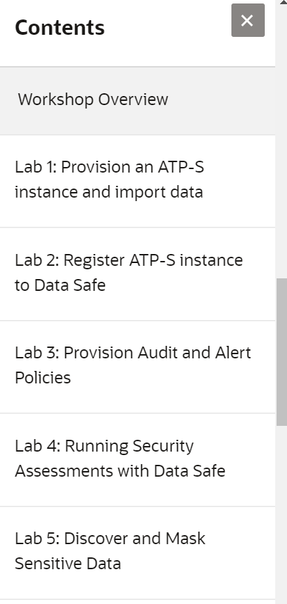

# Data Safe Workshop (PTS) #

## Workshop Overview ##

This workshop allows you to discover the features of Data Safe and use them to manage security features in an Autonomous Database.

## Workshop Requirements

To complete this lab, you need to have the following:
* Login credentials and a tenancy name for the Oracle Cloud Infrastructure Console
* A compartment enabled with permission to create and use resources

## Agenda

Specify the labs (and a longer explanation of the labs) here. Example:

- **Lab 1 :** Provision an ATP-S instance and import data

In this lab, you will provision an Automous Database instance and import demo data, inlcuding sensitive data (e.g. credit card numbers)

- **Lab 2 :** Register ATP-S instance to Data Safe

This section will register the database with Data Safe, so that we can use Data Safe to manager security features in our database.

- **Lab 3 :** Provision Audit and Alert Policies

In this lab, we'll explore the database auditing features provided by Data Safe.

- **Lab 4 :** Running Security Assessments with Data Safe

This lab will run an initial assessment with Data Safe, similar to the one provided through the Oracle Database Security Assessment Tool.

- **Lab 5 :** Discover and Mask Sensitive Data

This section will allow us to discover and anonymize sensitive data in our demo database.

## Access the labs ##

- Use **Lab Contents** menu on your right to access the labs.
    - If the menu is not displayed, click the menu button  on the top right  make it visible.

- From the menu, click on the lab that you like to proceed with. For example, if you like to proceed to **Lab 0**, click **Lab 0: Setup the Lab Environment**.

- You may close the menu by clicking 

## Acknowledgements

- **Authors** - Adrian Galindo & François Pons, PTS EMEA - April 2020.
- **Credits** - This lab is based on materials provided by Oracle Database Security Product Management.
