# Lab 1 - Provision an ATP-S instance and import data

## Objectives

* Sign in to Oracle Cloud Infrastructure
* Create an Autonomous Database
* Connect with SQL Developer
* Import sensitive data

## Disclaimer ##
The following is intended to outline our general product direction. It is intended for information purposes only, and may not be incorporated into any contract. It is not a commitment to deliver any material, code, or functionality, and should not be relied upon in making purchasing decisions. The development, release, and timing of any features or functionality described for Oracle’s products remains at the sole discretion of Oracle.

## Requirements ##

To complete this lab, you need to have the following:

* Login credentials and a tenancy name for the Oracle Cloud Infrastructure Console
* A compartment enabled with permission to create and use resources
* Demo data files employees.csv and emp_extended.csv

## STEP 1: Sign in to Oracle Cloud Infrastructure

From any browser, enter the following URL (change the region if needed):

[Oracle OCI Console](https://console.us-phoenix-1.oraclecloud.com/a/tenancy)


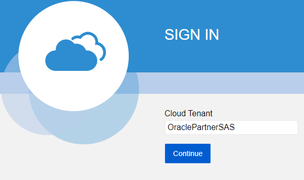


Under Oracle Cloud Infrastructure, enter the username and password provided by the instructor and then click Sign In.

## STEP 2: Create an Autonomous Database

Once logged in, navigate to the Autonomous Database section.

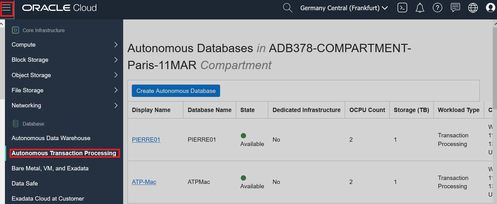


Make sure to select the region and compartment (under Training) that have been assigned to you, then click on the blue button **Create Autonomous Database**.

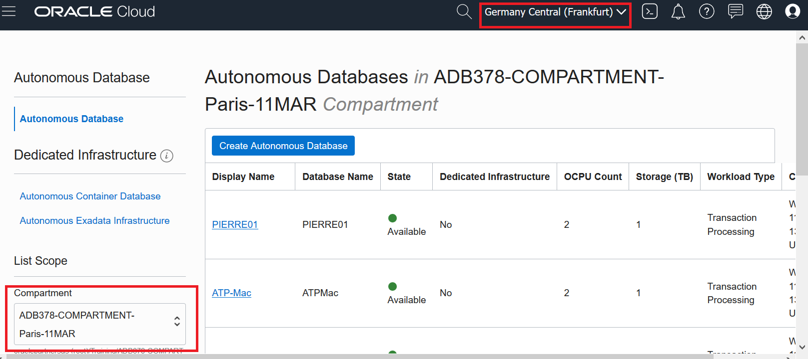

Enter all required details:

* Compartment :	keep value
* Display Name :	**ATP-[your-name]**
* Database Name	:	**ATP[your-initials]**
* Workload Type	:	Autonomous Transaction Processing
* Deployment :	Shared Infrastructure
* DB version : 19c
* CPU Core Count :	1
* Storage (TB) : 1
* Auto scaling : **Leave Unchecked**
* Password :	**OraclePTS#2020**
* Network access : Leave default selection
* License Type : BYOL (My Organization Already owns Oracle Database…)


This process will take a few minutes to complete…

<!---
  ==>

--->


==>


## STEP 3: Download Client Credentials (Wallet)

Once the Autonomous database is available, you need to download the client credentials package that will be required to connect from SQL Developer.
* Click on the details of your ATP.
* Select DB Connection.
* Select Instance Wallet.
* Download the wallet to your laptop.
* Enter a password for the wallet.


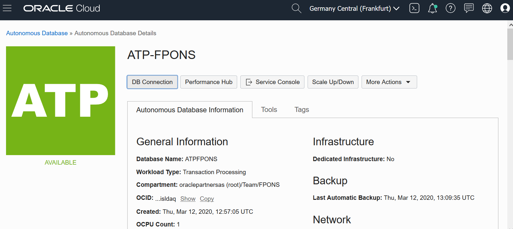

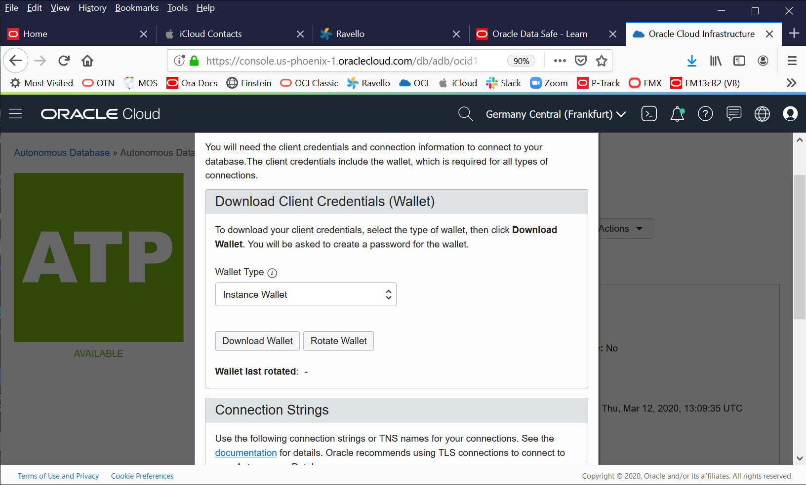

## STEP 4: Connect to ATP Using SQL Developer

In this lab section you will connect to the ATP with Oracle SQL Developer and import some demo data

* Start SQL Developer from your client
* Click + to create a new connection


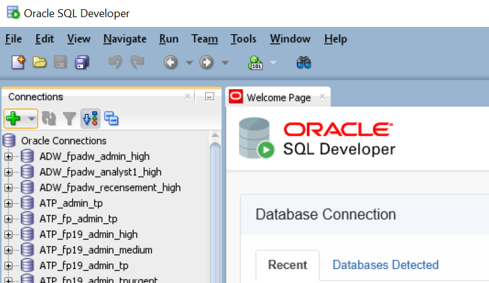

* Enter a connection name.
* Enter **ADMIN** as the user.
* Enter the password you used to create your ATP.
* Check Save Password check box.
* Select Connection Type as Cloud Wallet and Browse for your wallet.
* Browse and select your service. Ie: **[your ATP name]_tp**.  Note there are 5 services, select **tp**.
* Test the connection and Save your connection for later use.  Then click Connect.


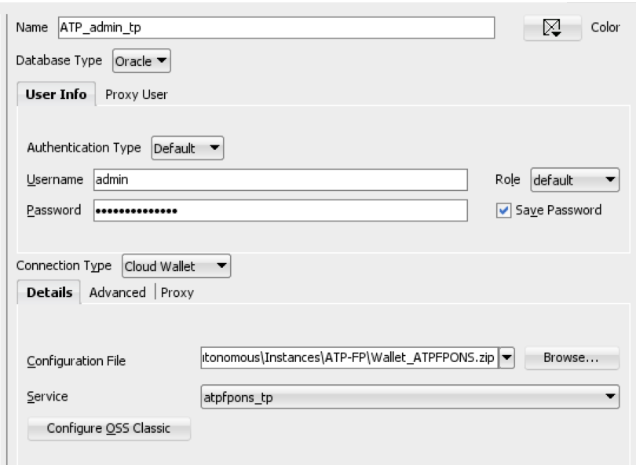

## STEP 5: Import demo tables

First download the following two files containing demo data and save them locally.

Download [**employees.csv**](./files/employees.csv) and save it locally.

Download [**emp_extended.csv**](./files/emp_extended.csv) and save it locally.

Using SQL Developer Worksheet, run the following statements to create a new schema

````
<copy>
create user hcm identified by "OraclePTS#2020";
grant DWROLE to hcm;
grant unlimited tablespace to hcm;
</copy>
````

Then create a new connection as the HCM user and connect.


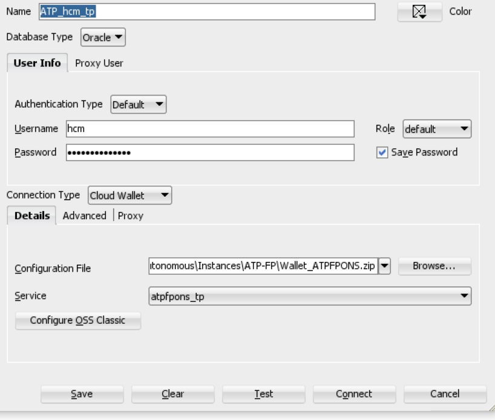

From the Connections navigator, open the connection as **HCM** and right-click on the Tables node, then select **Import Data**.

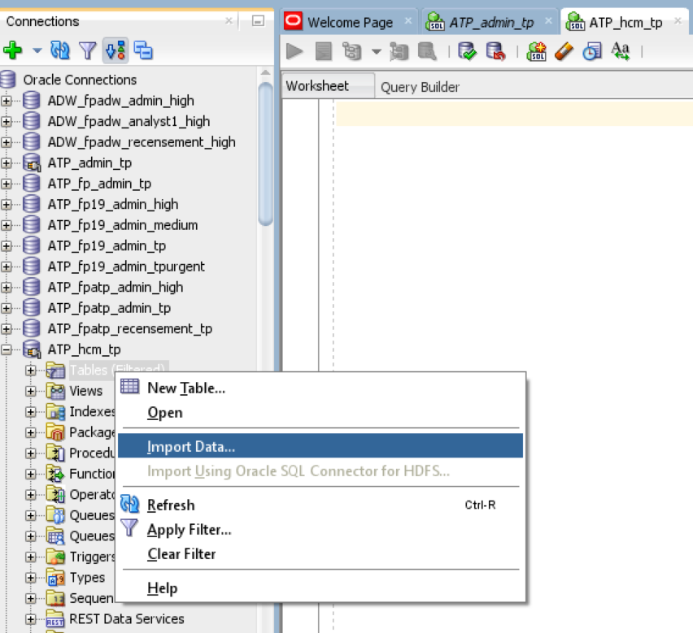

Browse to the **employees.csv** file and select it.

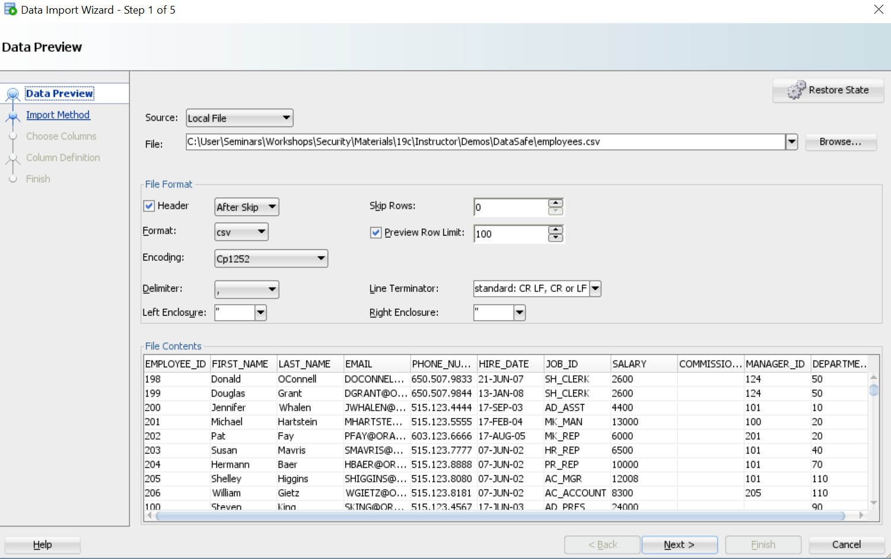

Click Next ad enter **EMPLOYEES** for table name.

Then click Next three times and Finish to import table EMPLOYEES.

Replicate the same steps to import table **EMP\_EXTENDED** from emp\_extended.csv.


## STEP 6: Gather statistics on the demo schema

Using your SQL Developer Worksheet connection as ADMIN, run the following statements to gather statistics.

````
<copy>
exec DBMS_STATS.GATHER_SCHEMA_STATS('HCM');
</copy>
````

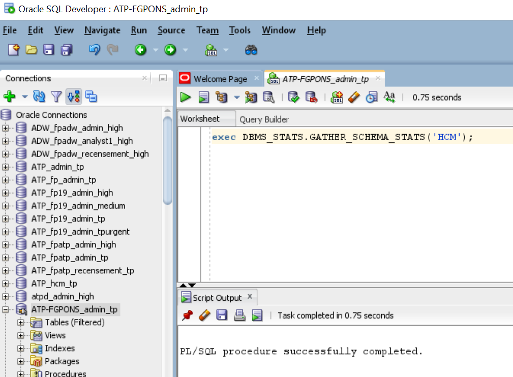

## STEP 7: View HCM data

Use SQL Developer to view HCM data. We will anonymize this data in Lab 5.


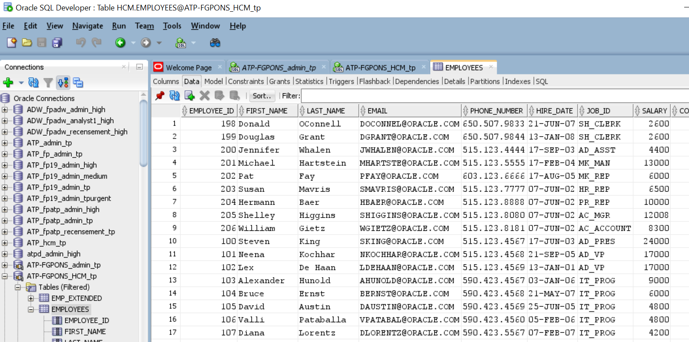

Continue with **Lab 2**.

## Acknowledgements ##

- **Authors** - Adrian Galindo & François Pons, PTS EMEA - April 2020.
- **Credits** - This lab is based on materials provided by Oracle Database Security Product Management.
