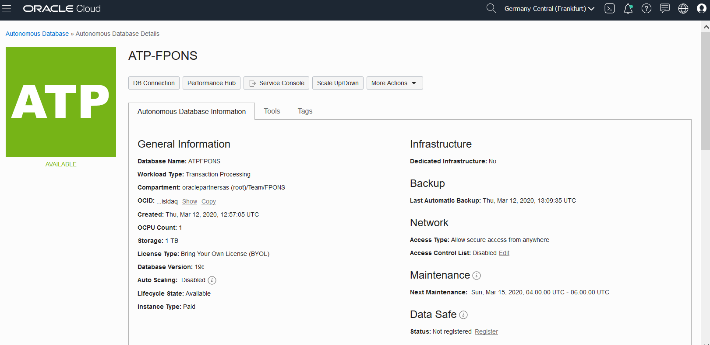
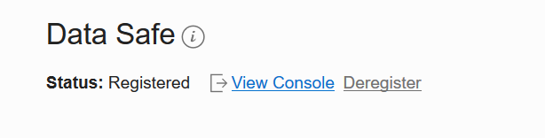
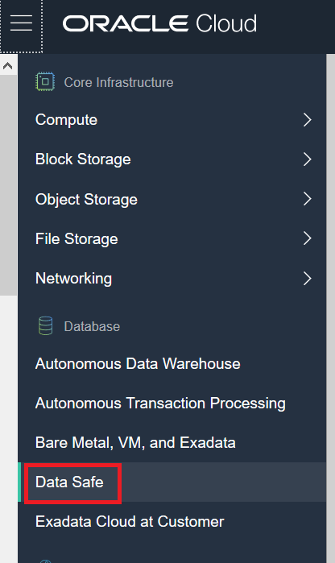
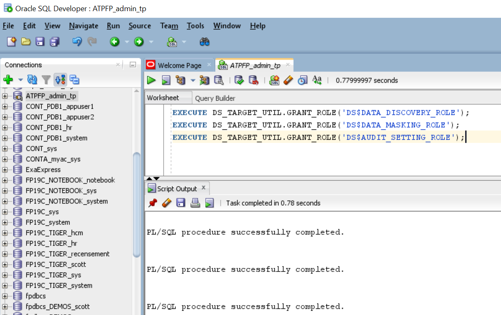
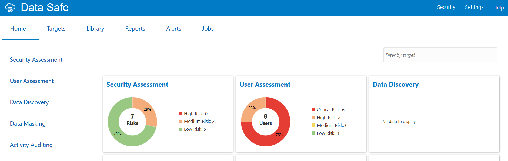

# Lab 2 - Register ATP-S instance to Data Safe  #

## Objectives

* Sign in to Oracle Cloud Infrastructure
* Register ATP-S instance to Data Safe
* Configure access privileges

## Disclaimer ##

The following is intended to outline our general product direction. It is intended for information purposes only, and may not be incorporated into any contract. It is not a commitment to deliver any material, code, or functionality, and should not be relied upon in making purchasing decisions. The development, release, and timing of any features or functionality described for Oracle’s products remains at the sole discretion of Oracle.

## Requirements ##

To complete this lab, you need to have the following:
*	Login credentials and a tenancy name for the Oracle Cloud Infrastructure Console
* A compartment enabled with permission to create and use resources
*	The ATP-S instance provisioned in Lab 1

## STEP 1: Register to Data Safe


The Data Safe service has already been enabled for your tenancy and region.
However, it is still necessary to register an ATP-S instance before it can be managed by Data Safe.
From the OCI console, navigate to the details of your Autonomous Database instance and click on Register in the Data Safe section at the right bottom of the page.



Click “Confirm”
The instance is registered after a few moments.



You can now  access to Data Safe console from the link provided. Alternatively, use the Data Safe menu in the main OCI console navigator (we’ll connect in Step 3).

<!-- -->


## STEP 2: Grant Roles for the Oracle Data Safe Service Account


Data Safe uses a pre-created ATP user (DS$ADMIN) that is enabled when the instance is registered.
The features that you can use depend on the roles granted to the Oracle Data Safe service account on that target database.
Note that some basic roles are granted by default, allowing ADMIN to run simple security and user assessments.

Change the TimeZome accordingly

`` 
ALTER DATABASE SET TIME_ZONE ='Asia/Tokyo'
`` 

and restart the database from the OCI Console

To enable all other Data Safe features, connect to ATP-S with SQL Developer as user **ADMIN** and execute the following GRANTs:

````
<copy>
EXECUTE DS_TARGET_UTIL.GRANT_ROLE('DS$DATA_DISCOVERY_ROLE');
EXECUTE DS_TARGET_UTIL.GRANT_ROLE('DS$DATA_MASKING_ROLE');
EXECUTE DS_TARGET_UTIL.GRANT_ROLE('DS$AUDIT_SETTING_ROLE'); 
</copy>
````



## STEP 3: Connect to Data Safe Service Console


Connect to Data Safe console by using one of the links mentioned at the end of Step 1.

You should be able to use the same username and password as for your OCI tenancy.



Continue with Lab 3.

## Acknowledgements ##

- **Authors** - Adrian Galindo & François Pons, PTS EMEA - April 2020.
- **Credits** - This lab is based on materials provided by Oracle Database Security Product Management.
