# Lab 4 - Running Security Assessments with Data Safe  #

## Objectives

*	Run a Security Assessment job against a target database
*	Analyze the security assessment results
*	Run a User Assessment job against a target database
*	Analyze the user assessment results

## Disclaimer ##

The following is intended to outline our general product direction. It is intended for information purposes only, and may not be incorporated into any contract. It is not a commitment to deliver any material, code, or functionality, and should not be relied upon in making purchasing decisions. The development, release, and timing of any features or functionality described for Oracle’s products remains at the sole discretion of Oracle.

## Requirements ##

To complete this lab, you need to have the following:
* Login credentials and a tenancy name for the Oracle Cloud Infrastructure Console
* A compartment enabled with permission to create and use resources
* The ATP-S instance provisioned in Lab 1-2-3

## STEP 1: Run a Security Assessment job against a target database

Sign in to Data Safe Service Console using the same username and password as for your OCI tenancy.
You can use Security Assessment to evaluate the current security state of your target databases and receive recommendations on how to mitigate the identified risks.

In the Oracle Data Safe Console, click the **Home** tab, and then click the **Security Assessment** tab.

<!--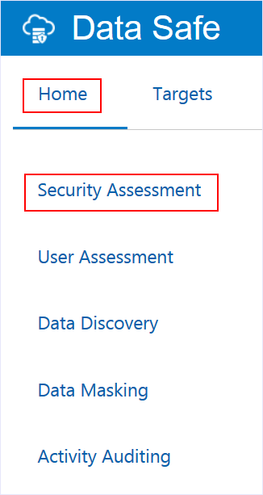-->

On the **Security Assessment** page, select the check box for your target database, and then click **Assess**. The assessment job will take a few minutes to complete.

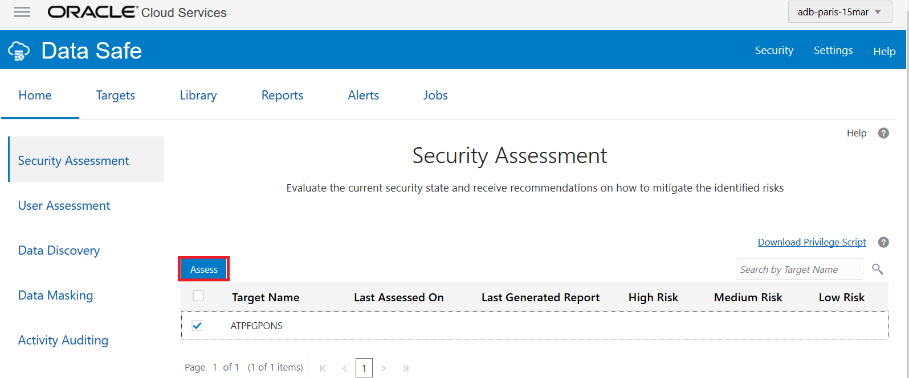

## STEP 2: Analyze the security assessment results

Once the assessment is completed, click on **View Report**

At the top of the **Comprehensive Assessment** report, you can view the target database name, when the database was assessed, and the database version.

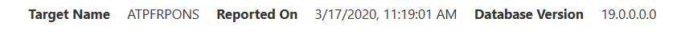

Also at the top of the report, you can view totals for the following:
Risk levels (**High Risk**, **Medium Risk**, **Low Risk**, **Advisory**, **Evaluate**, and **Pass**). These totals give you an idea of how secure your database is. Notice that the risk levels are color coded.

**Security Controls**, **User Security**, and **Security Configurations**. These totals show you the number of findings for each high-level category in the report.

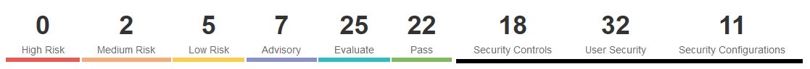

In the **Summary** category, you can view a table that compares the number of findings for each category and counts the number of findings per risk level. These values help you to identify areas that need attention.

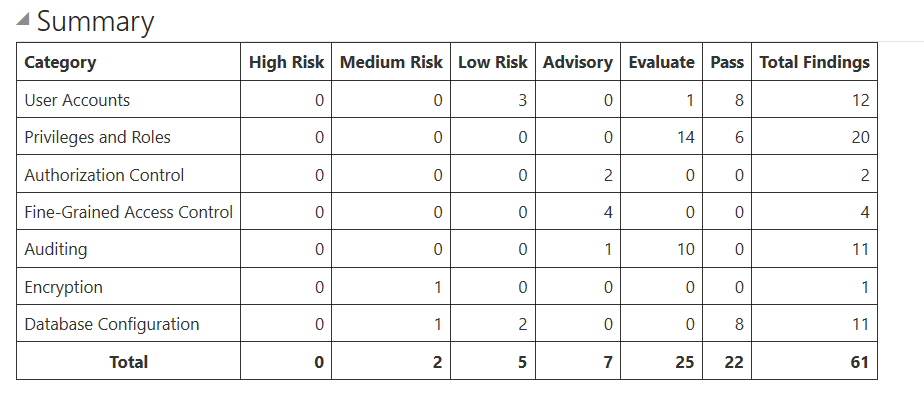

Expand **User Accounts** to view a list of all the user accounts in the target database. You can view each user's status, profile, and tablespace; whether the user is Oracle defined; and the authentication type for the user.

Expand **User Profiles** to view a list of profile names, parameters, and values.

Scroll down and expand categories. Each category lists related findings about your database and how you can make changes to improve its security.

On the right, indicators show whether a finding is recommended by the Center for Internet Security (**CIS**), European Union's General Data Protection Regulation (**GDPR**), and/or Security Technical Implementation Guide (**STIG**). These indications make it easy for you to identify the recommended security controls.

For, instance, expand the Advisory category and find out that Database Vault or Privilege Analysis are not configured in this database.

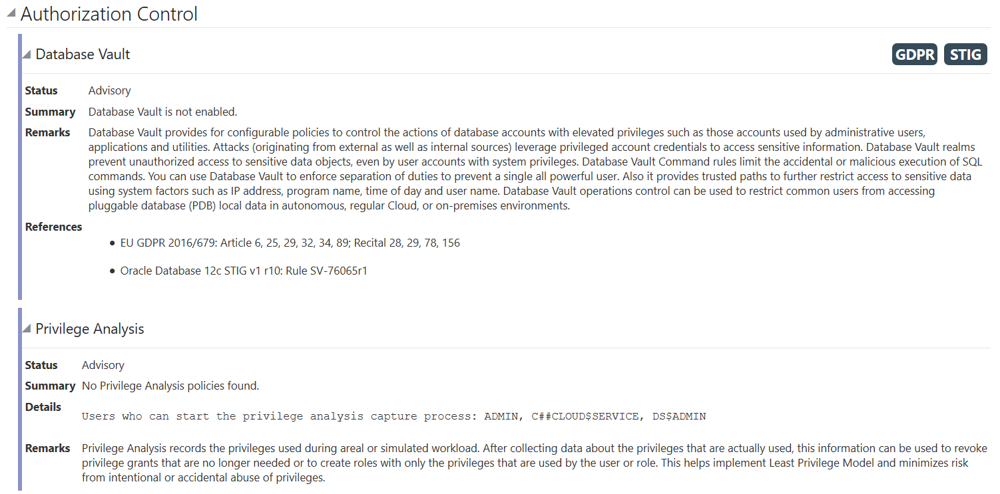

## STEP 3: Run a User Assessment job against a target database

You can use User Assessment to identify user settings and risks on your target databases.
*	Click the User Assessment tab.

<!--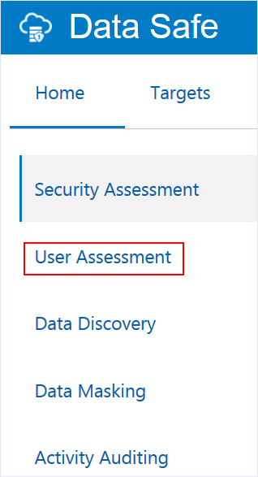-->

On the **User Assessment** page, select the check box for your target database, and then click **Assess**.

The assessment takes approximately 10 seconds.

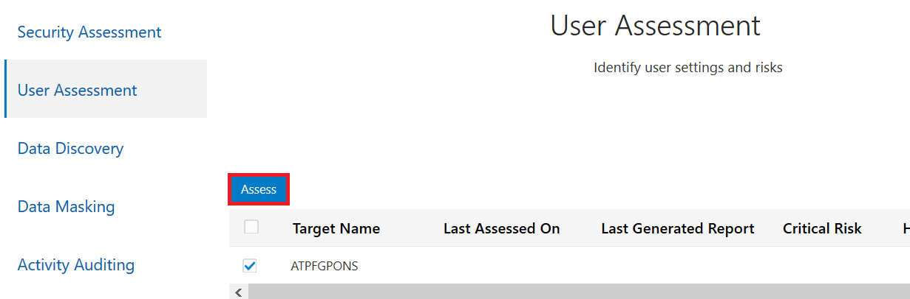

## STEP 4: Analyze the user assessment results

When the user assessment is completed, notice the following on the User Assessment page:

A green check mark is displayed in the Last Generated Report column.
You can view the number of **Critical Risk**, **High Risk**, **Medium Risk**, and **Low Risk** users.

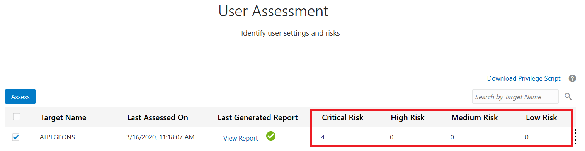

In the **Last Generated Report** column, click **View Report**.

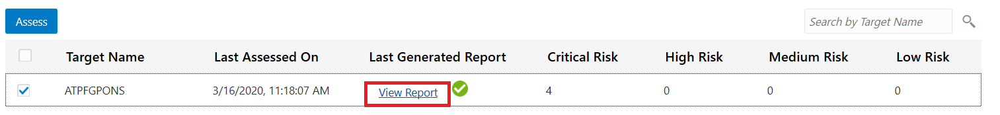

On the **Users** page, review the 4 charts. You can click the small circles below the charts to navigate between the charts.
The User Risk chart shows you the percent of users who are **Critical Risk**, **High Risk**, **Medium Risk**, and **Low Risk**.

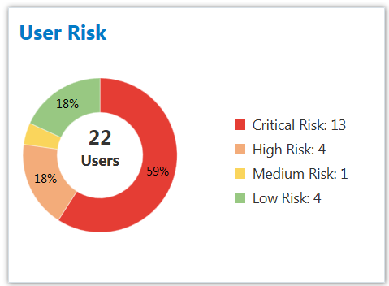

A **high risk** user is a user with high privileges who would then pose a risk if he were compromised.

The User Roles chart shows you the number of users with the **DBA**, **DV Admin**, and **Audit Admin** roles.

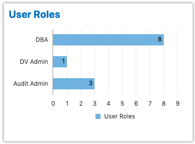

The **Last Password Change** chart shows you the number of users who have changed their passwords in the last 30 days, the last 30-60 days, and 60 days ago or more.

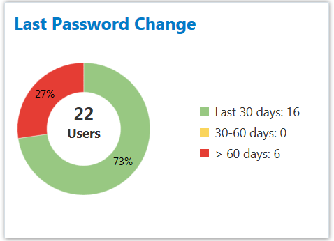

The **Last Login** chart shows you the number of users that signed in to the database within the last 24 hours, within the last week, within the current month, within the current year, and a year ago or more.

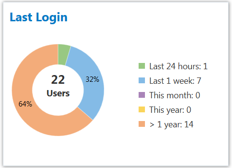

Review the table below the charts. This table lets you quickly identify critical and high risk users as well as other users that may pose risks, for example, users who are DBAs, DV Admins, and Audit Admins.
Scroll to the right. In the **Audit Records** column, click **View Activity** for the **ADMIN** user.

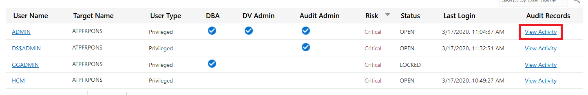

View the **All Activity** report.

The report is automatically filtered to show you the audit records for the **ADMIN** user, for the past week, and for your target database.

At the top of the report, you can view totals for Targets, DB Users, Client Hosts, Login Success, Login Failures, User Changes, Privilege Changes, DDLs, and DMLs.

The **Event** column shows you the activites performed by this user.

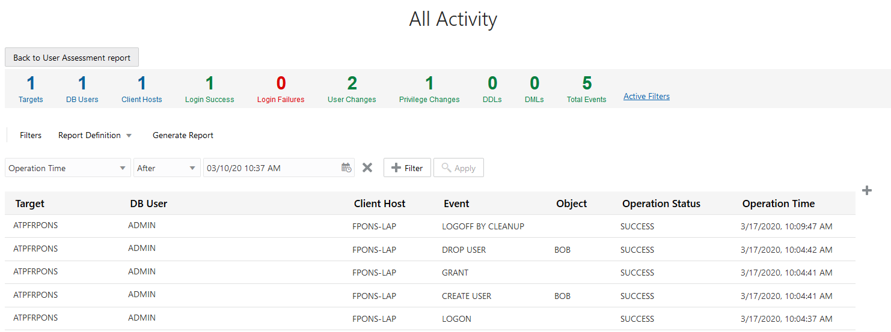

At the top of the report, click **Back to User Assessment** report.

Continue with Lab 5.

## Acknowledgements ##

- **Authors** - Adrian Galindo & François Pons, PTS EMEA - April 2020.
- **Credits** - This lab is based on materials provided by Oracle Database Security Product Management.
