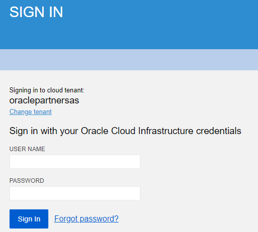
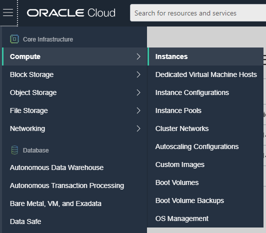
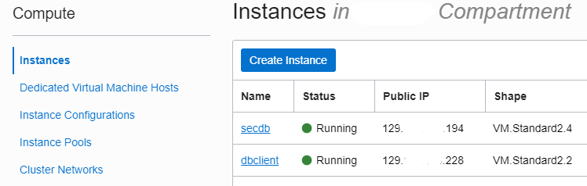
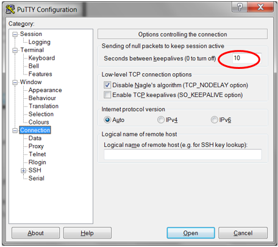
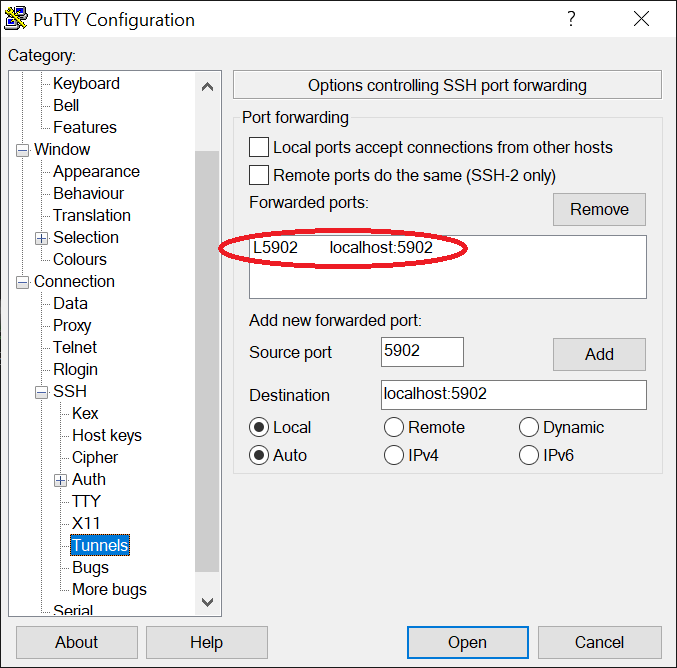
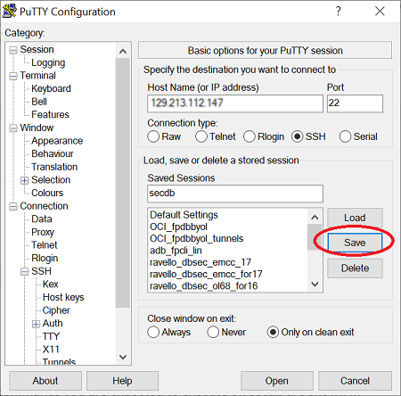
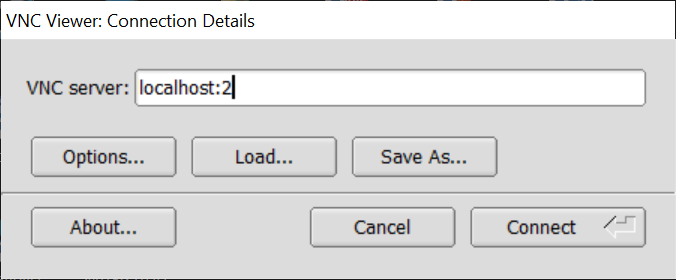
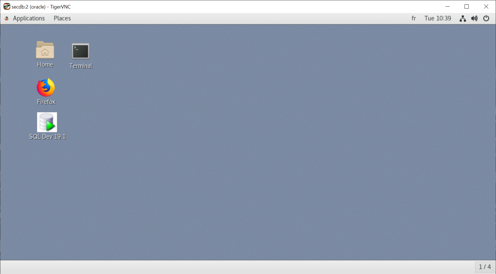

# Lab 0: Accessing Labs Environment

In this chapter, we will create connections to the labs environment and make sure we are ready for the hands-on.

Your environment is hosted on Oracle Cloud Infrastructure with the following compute instances (virtual machines):

* **secdb**: a Linux box hosting an Oracle Database 19c with a pluggable database PDB1 and most of the lab scripts. They are designed to be easily re-usable and are included in your [**Student's Package**](./files/Package.zip) for your reference or use in future projects.

* **dbclient**: a simple client machine with both 11gR2, 12cR2 and 18c instant clients. We can use it for some of the labs (e.g. when setting up network encryption).

* **av**: an Audit Vault Server 12.2 which will be configured as part of the labs.

* **emcc**: an Enterprise Manager Cloud Control 13cR2 whose agent is deployed on secdb.

The virtual machines can be accessed by using an **SSH** client (**Putty**, **MobaXterm**) or with `ssh` from a terminal (bash, Mac or Linux).

For secdb, **VNC** has also been configured to provide a GUI to the desktop.

## Requirements

* Access to the OCI tenancy as provided by the instructor.
* SSH client.
* Private key to access client machines by SSH. (The keys can be found [here](./files/dbsec_keys.zip))
* VNC client software.

## Step 1: Create SSH connections to secdb and dbclient ##

The instructor will explain how to identify the public IPs to the four virtual machines to be used.

### From Windows

Using the Public IPs, open a SSH client like **Putty** and configure two connections to **secdb** and **dbclient**. Here is an example for **secdb**:

Set user to **oracle** in **Connection** -> **Data** -> **Auto-login username** for **dbclient** and **secdb** connections.

Select the private key in **Connection** -> **SSH** -> **Auth** menu and save the configuration.

Additionally you can specify a keepalive of 10 seconds to prevent disconnections.

Also enable compression for better performance.

Finally, and **only for secdb**, create the following **tunnel**. VNC connections are secure and only possible through an SSH tunnel. Please create the following SSH tunnel in secdb's connection:

*	Source port : 5902
*	Destination : localhost:5902

Do not forget to **save** each PuTTY configuration:

### Connect from Linux or Mac

If you are using Linux, Mac or some bash terminal, you will need to use the private key in Open SSH format.

The file containing the private key to use in that case is dbseckey (without extension).

To connect to the dbclient or secdb servers from command line, use the following syntax (change the path to the directory holding the labkey file):

    $ cd /<path-to-keys-folder>/

Use the actual IP address for each server to create each terminal session:

    $ ssh -i dbseckey oracle@ip.address

The syntax to create an SSH tunnel to secdb enabling a VNC connection should be:

  ssh -L 5902:localhost:5902 -i .ssh/dbseckey oracle@ip.address

## Step 2: Create a GUI connection to secdb's desktop

For some labs, it will be easier to use a VNC connection to secdb. To do this, first connect using PuTTY to create the SSH tunnel and then launch a VNC client such as TigerVNC Viewer and connect to **localhost:2**

When asked for a password, enter **oracle**.

You now can start the workshop labs.

## Acknowledgements

- **Authors** - Adrian Galindo, PTS LAD & François Pons, PTS EMEA - Database Product Management - May 2020.
- **Credits** - This lab is based on materials provided by Oracle Database Security Product Management.
