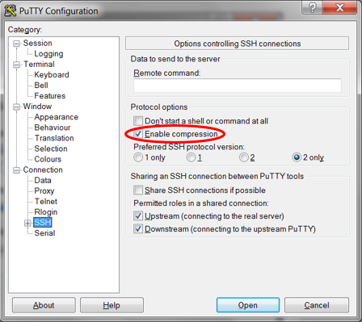

# Lab 0: Accessing Labs Environment

In this chapter, we will connect to the labs environment and make sure we are ready for the hands-on.
Your environment is hosted on Oracle Cloud Infrastructure with the following virtual machines as instances on IaaS:

- **secdb**: a Linux box hosting an Oracle Database 19c with a pluggable database PDB1 and most of the labs scripts: they are designed to be easily re-usable
- **dbclient**: a simple client machine with both 11gR2, 12cR2 and 18c instant clients. We can use it for some of the labs (e.g. when setting up network encryption)
- **av**: an Audit Vault Server 12.2 which will be configured as part of the labs
- **emcc**: an Enterprise Manager Cloud Control 13cR2 whose agent is deployed on secdb

The virtual machines can be used accessing with a SSH Client (Putty, MobaXterm) or with `ssh` on the command line (bash, mac or linux).
For secdb, the Virtual Cloud Network (**VNC**) is also configured to access a graphical environment.

## Requirements

* Access to the OCI tenancy as provided by the instructor.
* Private key to access client machines by SSH.
* VNC client software.

## Step 1: Connect to OCI Console ##

The instructor will explain how to identify the public IPs to the four virtual machines to be used.

## Step 2: Connect to the instances

### From Windows

Using the Public Address, open a SSH client like **Putty** and configure a connection.

Set the **oracle** user in Connection->Data->Auto-login username for **dbclient** and **secdb** connections.

Choose the private key on **Connection** -> **SSH** -> **Auth** menu and save the configuration.

Additionally you can specify a keepalive of 10 seconds to prevent disconnections.

Finally, enable compression to make a smoother connection. Save the session with a name and open the new connection to the server.

### Connect from Linux or Mac

If you are using Linux, Mac or some bash terminal, you will need to use the private key in Open SSH format.

The file containing the private key to use in that case is dbseckey (without extension).

To connect to the dbclient or secdb servers from command line, use the following syntax (change the path to the directory holding the labkey file):

    $ cd /<path-to-keys-folder>/

Use the actual IP address for each server, to open 2 terminals:

    $ ssh -i dbseckey oracle@ip.address

You now can start the workshop labs.

## Acknowledgements

- **Authors** - Adrian Galindo, PTS LAD & François Pons, PTS EMEA - Database Product Management - May 2020.
- **Credits** - This lab is based on materials provided by Oracle Database Security Product Management.
