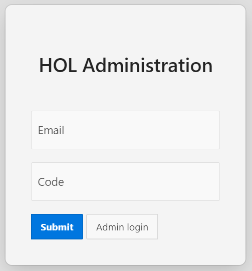
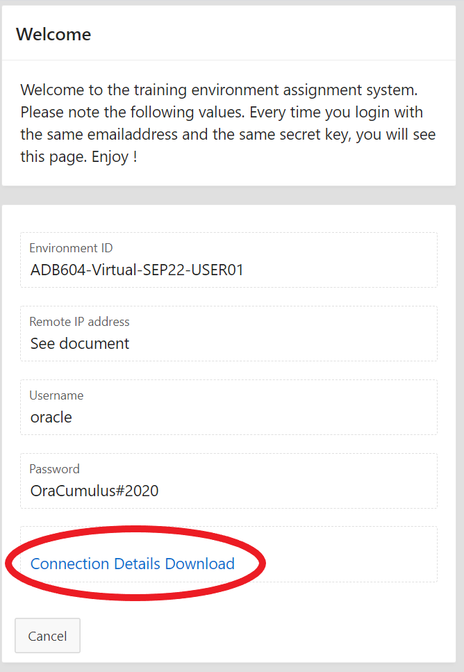
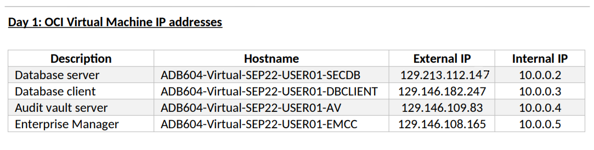

# Lab 0: Accessing the Labs Environment

In this chapter, we will create connections to the lab environment VMs and make sure we are ready for the hands-on.

Your environment is hosted on Oracle Cloud Infrastructure with the following compute instances (virtual machines):

* **secdb**: a Linux box hosting an Oracle 19C Database with a pluggable database PDB1 and most of the lab scripts. They are designed to be easily re-usable and are included in your [**Student's Package**](./files/Package.zip) for your reference or use in future projects.

* **dbclient**: a simple client machine with both 11gR2, 12cR2 and 18c instant clients. We can use it for some of the labs (e.g. when setting up network encryption).

* **av**: an Audit Vault Server 12.2 which will be configured as part of the labs.

* **emcc**: an Enterprise Manager Cloud Control 13cR2 installation.  There is a repository database with an agent that is deployed on secdb.

The virtual machines can be accessed by using an **SSH** client (**PuTTY**, **MobaXterm**) or with `ssh` from a terminal (bash, Mac or Linux).

For secdb, **VNC** has also been configured to provide a GUI to the desktop.

## Requirements

* Access to the Oracle Cloud (OCI) tenancy. 
* SSH client. **[Download PuTTY](https://www.putty.org/)**.
* Private key to access client machines by SSH. **[Download SSH keys](./files/dbsec_keys.zip)**.
* TigerVNC Viewer client software.  **[Download TigerVNC Viewer](https://tigervnc.org/)**.

## Step 1: Get IP addresses for your workshop VM environment. ##

To get IP addresses to your own workshop environment, visit **[http://holadmin.oraclepts.nl](http://holadmin.oraclepts.nl)** and enter your email and the secret code provided by the instructor.  Then hit *Submit*.

You will see a Welcome page where you click on "Connection Details Download".

A PDF file should download where you will see the public IPs for your workshop environment.  

- Database server = **secdb**
- Database client = **dbclient**

## Step 2: Create SSH connections to secdb and dbclient ##

### For Windows Users using PuTTY

Using the Public IPs, open a SSH client like **PuTTY** and configure separate connections to **secdb** and **dbclient**. Here is an example for **secdb**:

Set user to **oracle** in **Connection** -> **Data** -> **Auto-login username** for **dbclient** and **secdb** connections.

Download the **[Security SSH keys](./files/dbsec_keys.zip)**.  This is typically a file named dbsec\_keys.zip in your Downloads directory.  

Unzip dbsec\_keys.zip.  For PuTTY, locate the file *dbseckey.ppk*.

In PuTTY, go to the (**Connection** -> **SSH** -> **Auth**) menu. In the field *Private key file for authentication*, you will Browse for the private key file *dbseckey.ppk* which you just unzipped. 

Additionally you can specify a keepalive of 10 seconds to prevent disconnections.

Also enable compression for better performance.

Finally, and **only for secdb**, create the following **tunnel**. VNC connections are secure and only possible through an SSH tunnel. Please create the following SSH tunnel in secdb's connection:

*	Source port : 5902
*	Destination : localhost:5902

Do not forget to **save** each PuTTY configuration:

### Connect from Mac or Linux or Windows 10 Power Shell

If you are using Linux, Mac or some bash terminal, you will need to use the downloaded private key in Open SSH format (*dbseckey.pub*).

To connect to the dbclient or secdb servers from command line, use the following syntax (change the path to the directory holding the dbseckey.pub file):

    $ cd /<path-to-keys-folder>/

Use the actual IP address for each server to create each terminal session:

    $ ssh -i dbseckey.pub oracle@129.213.112.147

The syntax to create an SSH tunnel to secdb enabling a VNC connection should be (**Remember to use your own IP address**):

  ssh -L 5902:localhost:5902 -i .ssh/dbseckey.pub oracle@129.213.112.147

## Step 3: Create a GUI connection to secdb's desktop

For some labs, it will be easier to use a VNC connection to secdb. To do this, first connect using PuTTY to create the SSH tunnel and then launch a VNC client such as TigerVNC Viewer and connect to **localhost:2**

When asked for a password, enter **oracle**.

*Note: In case you need to work on the command line outside VNC, you can use WinSCP or another tool to copy files to your local computer. Connect as oracle and specify the private key to authenticate.*

Now, you can start the workshop labs.

## Acknowledgements

- **Authors** - Adrian Galindo, PTS LAD & François Pons, PTS EMEA - Database Product Management - May 2020.
- **Credits** - This lab is based on materials provided by Oracle Database Security Product Management.
