# Lab 1: Database Security Assessment Tool

The Oracle Database Security Assessment Tool (**DBSAT**) identifies sensitive data, analyzes database configurations, users, their entitlements and security policies to uncover security risks and improve the security posture of Oracle Databases within your organization.

## Disclaimer ##

The following is intended to outline our general product direction. It is intended for information purposes only, and may not be incorporated into any contract. It is not a commitment to deliver any material, code, or functionality, and should not be relied upon in making purchasing decisions. The development, release, and timing of any features or functionality described for Oracle’s products remains at the sole discretion of Oracle.

## Introduction  ##

You can use DBSAT to implement and enforce security best practices in your organization and accelerate compliance with regulations such as the EU GDPR.

DBSAT reports on existing sensitive data, the state of user accounts, role and privilege grants, and policies that control the use of various security features in the database.

DBSAT generates two types of reports:
- Database Security Risk Assessment report
- Database Sensitive Data Assessment report

You can use report findings to:
- Fix immediate short-term risks
- Implement a comprehensive security strategy

## Requirements ##

- **Lab 0: "Accessing to Labs environment"** completed.
- Session open to **secdb** with user **oracle**

## Step 1: Installing DBSAT

We will now install and run DBSAT on PDB1 in Container Database CONT.

### Create a DBSAT user with appropiate privileges

Go to the session opened to the **secdb** server.

Change to the lab directory

````
[oracle@secdb lab01_dbsat]$ <copy>cd /home/oracle/HOL/lab01_dbsat</copy>
````

Run `dbsat10_user.sh` to create a DBSAT local user with appropriate privileges.

````
[oracle@secdb lab01_dbsat]$ <copy>dbsat10_user.sh</copy>

(...)
SQL> alter session set container=pdb1;
Session altered.

SQL> --drop user dbsat cascade;
SQL> grant create session to dbsat identified by "MyDbPwd#1";
Grant succeeded.

SQL> grant select on sys.registry$history to dbsat;
Grant succeeded.

SQL> grant select_catalog_role to dbsat;
Grant succeeded.

SQL> -- if Database Vault has been enabled
SQL> grant dv_secanalyst to dbsat;
Grant succeeded.

SQL> -- 12c/18c/19c only
SQL> grant audit_viewer to dbsat;
Grant succeeded.

SQL> grant capture_admin to dbsat;
Grant succeeded.

SQL> -- 11g and 12c/18c/19c
SQL> grant select on sys.dba_users_with_defpwd to dbsat;
Grant succeeded.

SQL> -- 12c/18c/19c only
SQL> grant select on audsys.aud$unified to dbsat;
Grant succeeded.
(...)
````

We will now install and run DBSAT in the pluggable database PDB1.

### Unzip DBSAT distribution

The installation is a simple process. Execute the `dbsat20_install.sh` script:

````
[oracle@secdb lab01_dbsat]$ <copy>dbsat20_install.sh</copy>

(...)
Archive:  dbsat.zip
  inflating: dbsat/install/dbsat
  inflating: dbsat/install/dbsat.bat
  inflating: dbsat/install/sat_collector.sql
  inflating: dbsat/install/sat_reporter.py
  inflating: dbsat/install/sat_analysis.py
  inflating: dbsat/install/xlsxwriter/app.py
  inflating: dbsat/install/xlsxwriter/chart_area.py
  inflating: dbsat/install/xlsxwriter/chart_bar.py
  inflating: dbsat/install/xlsxwriter/chart_column.py
  inflating: dbsat/install/xlsxwriter/chart_doughnut.py
  inflating: dbsat/install/xlsxwriter/chart_line.py
  inflating: dbsat/install/xlsxwriter/chart_pie.py
  inflating: dbsat/install/xlsxwriter/chart.py
  inflating: dbsat/install/xlsxwriter/chart_radar.py
  inflating: dbsat/install/xlsxwriter/chart_scatter.py
  inflating: dbsat/install/xlsxwriter/chartsheet.py
  inflating: dbsat/install/xlsxwriter/chart_stock.py
  inflating: dbsat/install/xlsxwriter/comments.py
  inflating: dbsat/install/xlsxwriter/compatibility.py
  inflating: dbsat/install/xlsxwriter/contenttypes.py
  inflating: dbsat/install/xlsxwriter/core.py
  inflating: dbsat/install/xlsxwriter/custom.py
  inflating: dbsat/install/xlsxwriter/drawing.py
  inflating: dbsat/install/xlsxwriter/exceptions.py
  inflating: dbsat/install/xlsxwriter/format.py
  inflating: dbsat/install/xlsxwriter/__init__.py
  inflating: dbsat/install/xlsxwriter/packager.py
  inflating: dbsat/install/xlsxwriter/relationships.py
  inflating: dbsat/install/xlsxwriter/shape.py
  inflating: dbsat/install/xlsxwriter/sharedstrings.py
  inflating: dbsat/install/xlsxwriter/styles.py
  inflating: dbsat/install/xlsxwriter/table.py
  inflating: dbsat/install/xlsxwriter/theme.py
  inflating: dbsat/install/xlsxwriter/utility.py
  inflating: dbsat/install/xlsxwriter/vml.py
  inflating: dbsat/install/xlsxwriter/workbook.py
  inflating: dbsat/install/xlsxwriter/worksheet.py
  inflating: dbsat/install/xlsxwriter/xmlwriter.py
  inflating: dbsat/install/xlsxwriter/LICENSE.txt
  inflating: dbsat/install/Discover/bin/discoverer.jar
  inflating: dbsat/install/Discover/lib/ojdbc8.jar
  inflating: dbsat/install/Discover/lib/oraclepki.jar
  inflating: dbsat/install/Discover/lib/osdt_cert.jar
  inflating: dbsat/install/Discover/lib/osdt_core.jar
  inflating: dbsat/install/Discover/conf/sample_dbsat.config
  inflating: dbsat/install/Discover/conf/sensitive_en.ini
  inflating: dbsat/install/Discover/conf/sensitive_es.ini
  inflating: dbsat/install/Discover/conf/sensitive_de.ini
  inflating: dbsat/install/Discover/conf/sensitive_pt.ini
  inflating: dbsat/install/Discover/conf/sensitive_it.ini
  inflating: dbsat/install/Discover/conf/sensitive_fr.ini
  inflating: dbsat/install/Discover/conf/sensitive_nl.ini
  inflating: dbsat/install/Discover/conf/sensitive_el.ini
(...)
````


## Step 2: Run DBSAT Collector and Reporter

DBSAT collector will connect to the database and collect data needed for analysis. DBSAT will not create any objects in the database. DBSAT only executes queries similar to the ones a Database Administrator would be executing in his daily tasks.

### Running DBSAT Collector

To run DBSAT collector, we will use script `dbsat30_collect.sh`, which contains the full command line:

***dbsat collect dbsat/"[password]"@PDB1 dbsat_pdb1***

The time it takes to complete depends on the hardware and the data that needs to be collected. It might take between 2 to 5 minutes.

At the end of the process, you will be asked to provide a password (please use **oracle**) to protect the report file `dbsat_pdb1.zip`. Below is the expected output:


````
[oracle@secdb lab01_dbsat]$ <copy>dbsat30_collect.sh</copy>

Database Security Assessment Tool version 2.2.1 (May 2020)
(...)
Connecting to the target Oracle database...

(...)
Setup complete.
SQL queries complete.
OS commands complete.
Disconnected from Oracle Database 19c Enterprise Edition Release 19.0.0.0.0 - Production
Version 19.6.0.0.0
DBSAT Collector completed successfully.

Calling /u01/oracle/db/prod/19c/ee/bin/zip to encrypt dbsat_pdb1.json...

Enter password: oracle
Verify password: oracle
  adding: dbsat_pdb1.json (deflated 86%)
zip completed successfully.
````


### Running DBSAT Reporter

DBSAT reporter will take as input the file generated by the collector (json or zip file) and will produce one zip file containing four reports in different formats: HTML, spreadsheet, JSON and text. If you choose not to encrypt data, the four report files will be generated in the specified directory.

Let us first unzip the output produced in the previous step. The password is **oracle**.

````
[oracle@secdb lab01_dbsat]$ <copy>cd /home/oracle/HOL/lab01_dbsat/dbsat/install</copy>
````

````
[oracle@secdb lab01_dbsat]$ <copy>unzip dbsat_pdb1.zip</copy>

[oracle@secdb install]$ unzip dbsat_pdb1.zip
Archive:  dbsat_pdb1.zip
[dbsat_pdb1.zip] dbsat_pdb1.json password: oracle
  inflating: dbsat_pdb1.json
````

To run DBSAT reporter, we will use script `dbsat40_report.sh`, which contains the full command line:

***dbsat report dbsat_pdb1***

````
[oracle@secdb lab01_dbsat]$ <copy>cd /home/oracle/HOL/lab01_dbsat</copy>
````

Enter once again **oracle** as password to protect the zip file produced by DBSAT Reporter.

````
[oracle@secdb lab01_dbsat]$ <copy>dbsat40_report.sh</copy>

Database Security Assessment Tool version 2.2.1 (May 2020)
(...)

DBSAT Reporter ran successfully.

Calling /usr/bin/zip to encrypt the generated reports...

Enter password: oracle
Verify password: oracle
        zip warning: dbsat_pdb1_report.zip not found or empty
  adding: dbsat_pdb1_report.txt (deflated 79%)
  adding: dbsat_pdb1_report.html (deflated 84%)
  adding: dbsat_pdb1_report.xlsx (deflated 3%)
  adding: dbsat_pdb1_report.json (deflated 82%)
zip completed successfully.
````

Let us unzip the file produced by DBSAT Reporter in order to view the four files generated. Password is **oracle**.

````
[oracle@secdb lab01_dbsat]$ <copy>cd /home/oracle/HOL/lab01_dbsat/dbsat/install</copy>
````

````
[oracle@secdb lab01_dbsat]$ <copy>unzip dbsat_pdb1_report.zip</copy>

[oracle@secdb install]$ unzip dbsat_pdb1_report.zip
Archive:  dbsat_pdb1_report.zip
[dbsat_pdb1_report.zip] dbsat_pdb1_report.txt password: oracle
  inflating: dbsat_pdb1_report.txt
  inflating: dbsat_pdb1_report.html
  inflating: dbsat_pdb1_report.xlsx
  inflating: dbsat_pdb1_report.json
````


### Explore Database Security Risk Assessment Report

If you are inside the graphical environment connected through VNC, launch the browser and open the html file generated: **dbsat\_pdb1\_report.html**

*Note: In case you are working on the command line outside VNC, you can use WinSCP or another tool to copy the file to your local computer. Connect as oracle and specify the private key to authenticate.*

Please take a couple of minutes to scroll through the html report. You can click the links in the summary table to go to a specific section or use the navigation arrows at the bottom right.

The report contains *informational tables*, as the one shown below and *findings*. We will get back to the findings later. Informational tables provide either summary information or additional context to the findings in the same section.

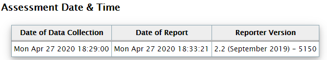

At the top of the report, you will find information about the Collector and Reporter run details as the date of *data collection* and the *date of report* generation along with the reporter version.
The Summary table presents all the findings per section/domain along with their severity level.

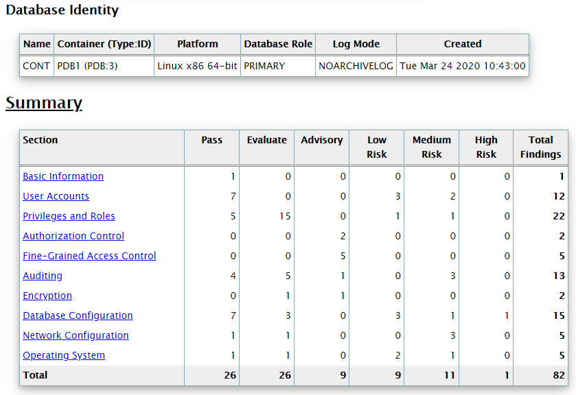


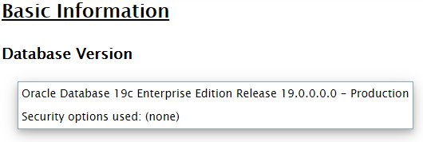

The DBSAT reporter resulting analysis is reported in units called ***Findings***. In each Finding you see:

**Unique ID for the Rule** The ID has two parts: the prefix identifies the report section, and the suffix identifies the specific rule.

**Status** You can use the status values as guidelines for implementing DBSAT recommendations. They can be used to prioritize and schedule changes based on the level of risk, and what it might mean to your organization. High risk might require immediate remedial action, whereas other risks might be fixed during a scheduled downtime, or bundled together with other maintenance activities.

- Pass: no error found
- Evaluate: needs manual analysis
- Low Risk
- Medium Risk
- High Risk
- Advisory: improve security posture by enabling additional security features and technology.

**Summary** A brief summary of the finding. When the finding is informational, the summary typically reports only the number of data elements that were examined.

**Details** Provides detailed information to explain the finding summary, typically results from the assessed database, followed by any recommendations for changes.

**Remarks** Explains the reason for the rule and recommended actions for remediation.

**References** If the finding is related to a CIS Oracle Database Benchmark 12c v2.0.0 recommendation or related to a GDPR Article/Recitals it will be mentioned here.

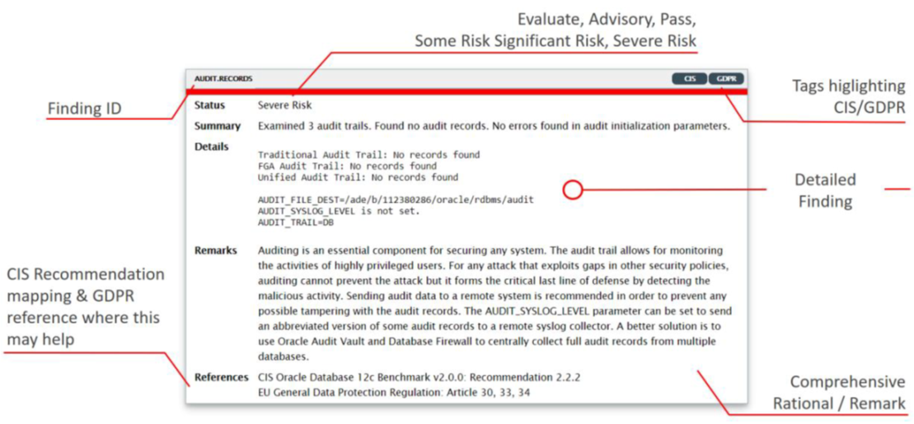

Currently, our PDB1 database is not using many security features at all!

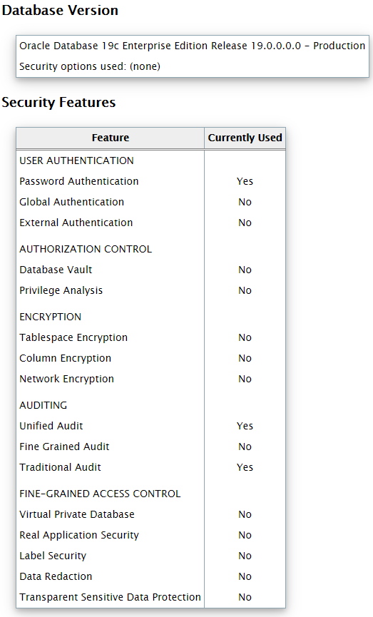

In the next chapters, we will follow some of DBSAT’s Advisory findings to strengthen the security of our database. For example, in the Encryption section, DBSAT recommends to consider encrypting data:

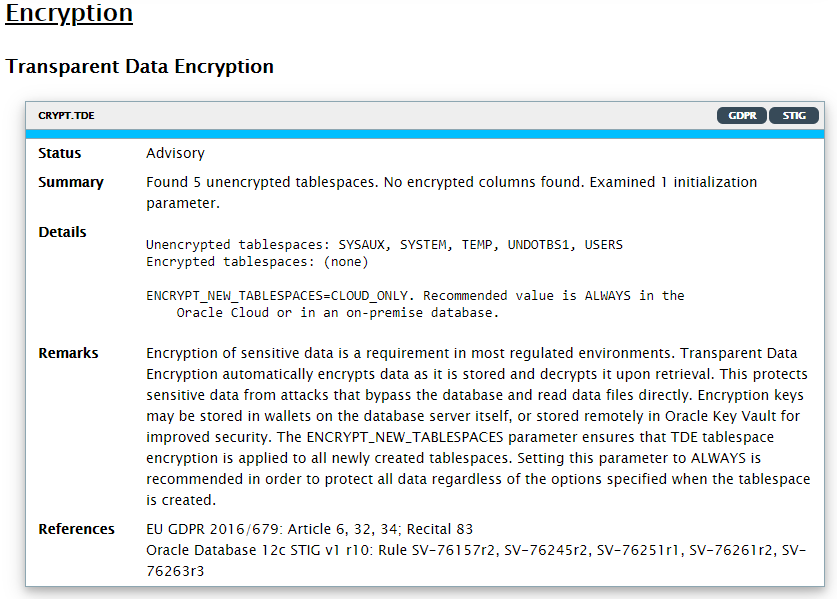


## Step 3: Running DBSAT Discoverer

DBSAT Discoverer quickly provides a view on where sensitive data resides, which is helpful on the path to GDPR compliance. DBSAT will not create any objects in the database.

Here is the Sensitive and Personal data you may discover in Oracle Databases:

- Personally identifiable information (PII), Health Data, Job data, IT Data...
- Religion, Political Affiliation, Trade Union Membership, Criminal, Race, etc.

Let’s run DBSAT Discoverer on PDB1

### Update Configuration Files

DBSAT discoverer will connect to the database and collect data needed for analysis based on settings specified in configuration files. Create the configuration file `dbsat.config` and make sure it is updateable:

````
[oracle@secdb lab01_dbsat]$ <copy>cd /home/oracle/HOL/lab01_dbsat/dbsat/install/Discover/conf</copy>
````

````
[oracle@secdb lab01_dbsat]$ <copy>cp sample_dbsat.config dbsat.config</copy>
````

````
[oracle@secdb lab01_dbsat]$ <copy>chmod +w dbsat.config</copy>
````


Now use the editor of your choice (e.g. vi, gedit) to set the database service name in dbsat.config. Update the value of parameter **DB\_SERVICE\_NAME** to **PDB1** as follows:

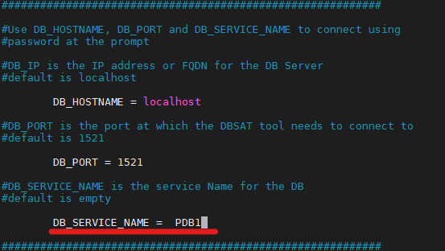

### Run DBSAT Discoverer

To run DBSAT discoverer, we will use script `dbsat50_discover.sh`, which contains the full command line:

***dbsat discover -c Discover/conf/dbsat.config pdb1sensitivedata***


````
[oracle@secdb conf]$ <copy>cd /home/oracle/HOL/lab01_dbsat</copy>
````

Connect as **dbsat** with password **MyDbPwd#1** to run `dbsat50_discover.sh`. At the end of the script, enter **oracle** as password to protect the output file `pdb1sensitivedata_report.zip`.


````
[oracle@secdb lab01_dbsat]$ <copy>./dbsat50_discover.sh</copy>

Database Security Assessment Tool version 2.2.1 (May 2020)
(...)

Enter username: dbsat
Enter password: MyDbPwd#1
DBSAT Discover ran successfully.
Calling /usr/bin/zip to encrypt the generated reports...

Enter password: oracle
Verify password: oracle
        zip warning: pdb1sensitivedata_report.zip not found or empty
  adding: pdb1sensitivedata_discover.html (deflated 81%)
  adding: pdb1sensitivedata_discover.csv (deflated 78%)
Zip completed successfully.
(...)
````

Unzip the report file to be able to check the contents by opening it the browser inside the Graphical Environment to **secdb**. You will be asked for the password to unzip. Enter **oracle** when requested.

*Note: In case you are working on the command line outside VNC, you can use WinSCP or another tool to copy the file to your local computer. Connect as oracle and specify the private key to authenticate.*

````
[oracle@secdb install]$ <copy>cd /home/oracle/HOL/lab01_dbsat/dbsat/install</copy>
````

````
[oracle@secdb install]$ <copy>unzip pdb1sensitivedata_report.zip</copy>

Archive:  pdb1sensitivedata_report.zip
[pdb1sensitivedata_report.zip] pdb1sensitivedata_discover.html password:
  inflating: pdb1sensitivedata_discover.html
  inflating: pdb1sensitivedata_discover.csv
````

### Explore the Sensitive Data Assessment Report

Open the file with the Sensitive Data Assessment Report: **pdb1sensitivedata_discover.html**

At the top of the report, you will find information about the Discoverer run details as the Date of *DBSAT Report Generation* along with the DBSAT *Discoverer version*.

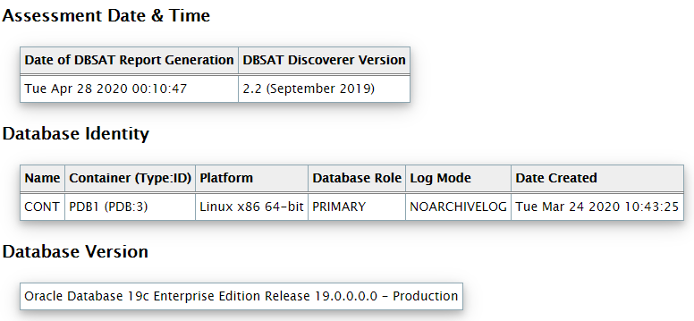

Follows the Database Identity information where you will find details about the target database This section may vary depending on whether dbsat connects to a non-CDB, CDB or PDB.

Then the *Discovery Parameters* table. The Discover Parameters table shows the parameters that were used from the *dbsat.config* file.

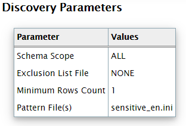

You can change many parameters in the configuration file:

- **Schemas Scope=ALL** Enables to choose if the search takes all schemas into account (except SYS, SYSTEM and other Oracle maintained schemas) or a limited set of comma separated schemas. By default, ALL will target all schemas and will discover accordingly.
- **Exclusion List File = NONE**  Allows to exclude from the results all tables from a schema (schemaD), a whole table (schemaA.tableA), or certain columns (schemaA.tableB.columnA ; schemaB.tableA.columnC).
- **Minimum Rows Count = [1 (default)]** Exclude tables with less than X rows from the result set. This enables to exclude tables with less than a certain number of rows. This argument is used to define the weight of tables to be considered by the discoverer. It enables to produce a smaller and more focused report. 19 | Database Security: Identifying Security Risks and Sensitive Data with DBSAT [INTERNAL]
- **Pattern File(s) = [sensitive.ini (default), other.ini, …]**  By default, sensitive_en.ini is used and it contains patterns in English and will look for English based sensitive columns/comments. This parameter enables the end user to choose which pattern ini files to add to the search. We provide sample pattern files in other languages in ./dbsat/install/Discover/conf

````
[oracle@secdb lab01_dbsat]$ <copy>ls -l /home/oracle/HOL/lab01_dbsat/dbsat/install/Discover/conf</copy>

total 236
-rw-r--r--. 1 oracle oinstall  5907 Apr 28 00:10 dbsat.config
-r--r--r--. 1 oracle oinstall  5902 Sep 11  2019 sample_dbsat.config
-r--r--r--. 1 oracle oinstall 29090 Sep 11  2019 sensitive_de.ini
-r--r--r--. 1 oracle oinstall 12642 Sep 11  2019 sensitive_el.ini
-r--r--r--. 1 oracle oinstall 31911 Sep 11  2019 sensitive_en.ini
-r--r--r--. 1 oracle oinstall 26829 Sep 11  2019 sensitive_es.ini
-r--r--r--. 1 oracle oinstall 27308 Sep 11  2019 sensitive_fr.ini
-r--r--r--. 1 oracle oinstall 25172 Sep 11  2019 sensitive_it.ini
-r--r--r--. 1 oracle oinstall 26302 Sep 11  2019 sensitive_nl.ini
-r--r--r--. 1 oracle oinstall 27424 Sep 11  2019 sensitive_pt.ini
````

**Summary Table**

The Summary will show you, organized by Sensitive Category, the number of tables, the number of columns and the number or rows.


**Sensitive Data section**

In this section you will see a list of findings. Each finding is comprised of:

- Risk Level – Low Risk, Medium Risk and High Risk
- Summary – A brief summary of what was found - number of schemas or tables/columns
- Location – In which SCHEMA.TABLE sensitive data was found

The first one lists the Schemas with Sensitive Data and then follows one finding per Sensitive Category. The report shows Tables Detected within *Sensitive Category:PII*.

Personally identifiable information (PII) is any data that could potentially identify a specific individual. Any information that can be used to distinguish one person from another and can be used for de-anonymizing anonymous data can be considered PII.

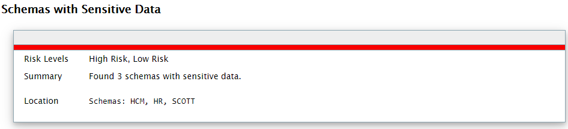

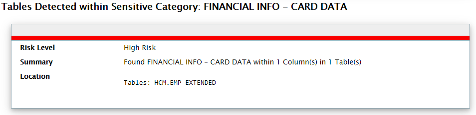

A detailed report of tables with sensitive data is provided at the end of the report.

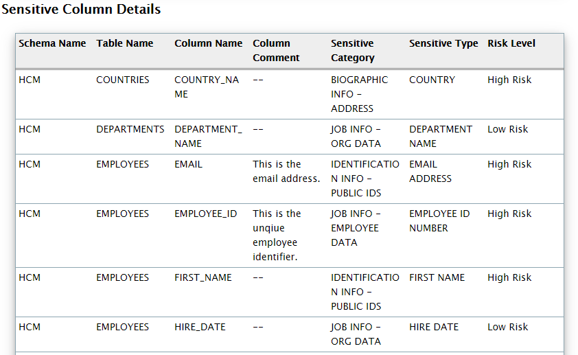

The Discoverer CSV report can be loaded into Oracle Audit Vault and Database Firewall to add sensitive data context to the new Data Privacy reports. We will be doing this as part of the Audit Vault lab.


This completes the DBSAT lab. You can continue with lab 2.

## Acknowledgements ##

- **Authors** - Adrian Galindo, PTS LAD & François Pons, PTS EMEA - Database Product Management - May 2020.
- **Credits** - This lab is based on materials provided by Oracle Database Security Product Management.
