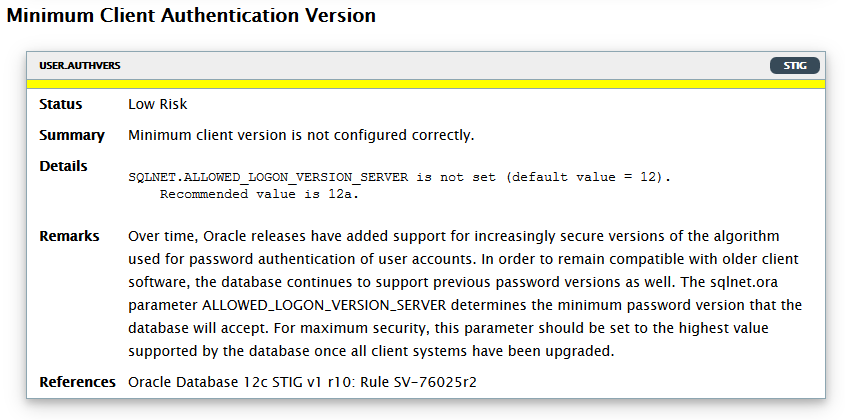
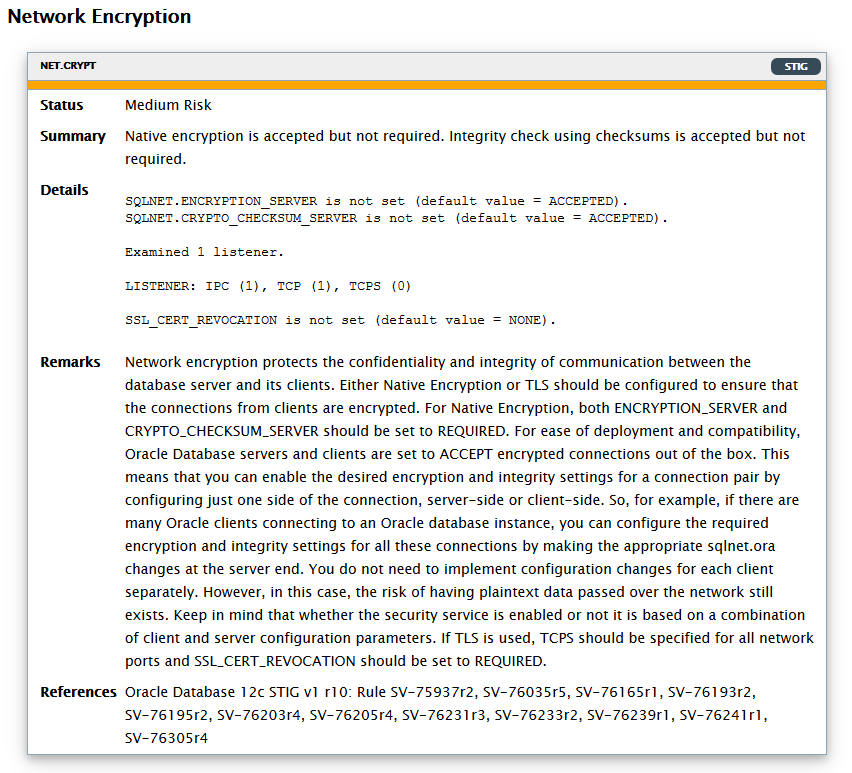

# Lab 2: Network Encryption

One of the basic protection that you can set on the database is the **Network Encryption**.

## Disclaimer ##

The following is intended to outline our general product direction. It is intended for information purposes only, and may not be incorporated into any contract. It is not a commitment to deliver any material, code, or functionality, and should not be relied upon in making purchasing decisions. The development, release, and timing of any features or functionality described for Oracle’s products remains at the sole discretion of Oracle.

## Requirements

- Session open to **secdb** with user **oracle**
- session open to **dbclient** with user **oracle**   

## Introduction  ##

**Network Encryption** is included with all editions since version 11gR2 so you can configure and start using it without any additional licensing.

On Cloud environments is configured by default. In this chapter, we will address the problem of cyber-attacks and network hijacking and we learn how to configure it in an On Premise environment.

## Step 1: Setting Minimum Client Authentication to version 12

Over time, Oracle releases have added support for increasingly secure versions of the algorithm used for password authentication of user accounts. For maximum security, we should restrict connections to 12c clients using the most advanced algorithms for password authentication.
This would address the following DBSAT finding:



### Check Default Configuration

Check that default configuration allows 11gr2 clients to connect

Use a terminal window to **dbclient** (as **oracle**) and run the following to verify that we can connect to the database from an old Oracle client (11gR2).

````
[oracle@dbclient lab02_network]$ <copy>cd /home/oracle/HOL/lab02_network</copy>
````

````
[oracle@dbclient lab02_network]$ <copy>./check_client_11gR2.sh</copy>

(...)
SQL> SQL>
 REGION_ID REGION_NAME
---------- -------------------------
         1 Europe
         2 Americas
         3 Asia
         4 Middle East and Africa
(...)
````

### Set minimum client authentication version to 12

Now run the following commands from a terminal connection to the database.

````
[oracle@secdb lab02_network]$ <copy>cd /home/oracle/HOL/lab02_network</copy>
````

````
[oracle@secdb lab02_network]$ <copy>./net10_set_client_auth.sh</copy>

(...)
Adding the following lines to sqlnet.ora:
#
# Set minimum client authentication version to 12
#
SQLNET.ALLOWED_LOGON_VERSION_SERVER = 12a
(...)
````

From **dbclient**, verify that we can no longer connect from an 11gR2 client:

````
[oracle@dbclient lab02_network]$ <copy>./check_client_11gR2.sh</copy>

SQL*Plus: Release 11.2.0.4.0 Production on Wed Mar 6 11:41:03 2019

SQL> ERROR:
ORA-28040: No matching authentication protocol
````

However, we can still connect from the default 18c instant client:

````
[oracle@dbclient HOL]$ <copy>cd /home/oracle/HOL</copy>
````

````
[oracle@dbclient HOL]$ <copy>run_applic.sh</copy>

(...)
SQL> select SYS_CONTEXT('USERENV','HOST') from dual;

SYS_CONTEXT('USERENV','HOST')
-----------------------------
ol68

SQL> select SYS_CONTEXT('USERENV','MODULE') from dual;

SYS_CONTEXT('USERENV','MODULE')
-------------------------------
SQL*Plus

SQL> select SYS_CONTEXT('USERENV','SESSION_USER') from dual;

SYS_CONTEXT('USERENV','SESSION_USER')
-------------------------------------
HR

SQL> select * from regions;

 REGION_ID REGION_NAME
---------- -------------------------
         1 Europe
         2 Americas
         3 Asia
         4 Middle East and Africa
(...)
````

## Step 2:  Configuring Network Encryption and Data Integrity Algorithms

DBSAT has produced the following finding:



Encrypting network data provides data privacy so that unauthorized parties cannot view plaintext data as it passes over the network.
To enforce a data integrity algorithm, a keyed, sequenced implementation of the Message Digest 5 (MD5) algorithm or the Secure Hash Algorithm (SHA-1 and SHA-2) should also be configured. Both of these hash algorithms create a checksum that changes if the data is altered in any way. This protection operates independently from the encryption process so you can enable data integrity with or without enabling encryption.

Oracle Database therefore provides protection against two forms of active attacks:

#### Data modification attack
An unauthorized party intercepting data in transit, altering it, and retransmitting it is a data modification attack. For example, intercepting a $100 bank deposit, changing the amount to $10,000, and retransmitting the higher amount is a data modification attack.

#### Replay attack
Repetitively retransmitting an entire set of valid data is a replay attack, such as intercepting a $100 bank withdrawal and retransmitting it ten times, thereby receiving $1,000.

The easiest way to verify whether a network encryption or a data integrity algorithm has been configured is to query `v$session_connect_info.network_service_banner`.

### Check `network_service_banner` **Before** configuring Network Encryption

Run the following query from the **dbclient**:

````
[oracle@dbclient ~]$ <copy>cd ~/HOL/lab02_network/</copy>
````

````
[oracle@dbclient lab02_network]$ <copy>check_network_enc.sh</copy>

SQL*Plus: Release 19.0.0.0.0 - Production on Thu May 7 23:56:48 2020
Version 19.6.0.0.0

Copyright (c) 1982, 2019, Oracle.  All rights reserved.

Connected.
SQL> set linesize 120
SQL> col network_service_banner for a85
SQL> select i.network_service_banner
  2    from
  3      v$session_connect_info i, v$session s
  4    where
  5     s.sid=i.sid and
  6     s.serial# = i.serial# and
  7     s.username = 'SYSTEM';

NETWORK_SERVICE_BANNER
----------------------
TCP/IP NT Protocol Adapter for Linux: Version 19.0.0.0.0 - Production
Encryption service for Linux: Version 19.0.0.0.0 - Production
Crypto-checksumming service for Linux: Version 19.0.0.0.0 - Production
(...)
````

The three lines in the result just reflect the capabilities of the Oracle Net’s version currently in use. You will see how the output differs when reflecting what algorithms are actually in use.

### Configuring Network Encryption and Data Integrity

It is possible to enforce Oracle Net encryption and set a data integrity algorithm by setting parameters in sqlnet.ora on the server side. Run the following commands from a terminal connection to the **secdb** server .

````
[oracle@secdb ~]$ <copy>cd ~/HOL/lab02_network/</copy>
````

````
[oracle@secdb lab02_network]$ <copy>net20_add_net_enc.sh</copy>
Add the following lines to sqlnet.ora:
#
# Network encryption algorithm
# (data is secure as it travels across the network)
#
SQLNET.ENCRYPTION_SERVER = required
SQLNET.ENCRYPTION_TYPES_SERVER= (AES128)
#
# Network encryption - integrity algorithm
# (protection from data modification or replay attack)
#
SQLNET.CRYPTO_CHECKSUM_SERVER = required
SQLNET.CRYPTO_CHECKSUM_TYPES_SERVER= (SHA256)
````

### Check `network_service_banner` after configuring Network Encryption

Now run again the following query from the **dbclient**:

````
[oracle@dbclient lab02_network]$ <copy>cd ~/HOL/lab02_network/</copy>
````

````
[oracle@dbclient lab02_network]$ <copy>check_network_enc.sh</copy>

(...)
SQL> col network_service_banner for a85
SQL> select i.network_service_banner
  2    from
  3      v$session_connect_info i, v$session s
  4    where
  5     s.sid=i.sid and
  6     s.serial# = i.serial# and
  7     s.username = 'SYSTEM';

NETWORK_SERVICE_BANNER
----------------------
TCP/IP NT Protocol Adapter for Linux: Version 19.0.0.0.0 - Production
Encryption service for Linux: Version 19.0.0.0.0 - Production
AES128 Encryption service adapter for Linux: Version 19.0.0.0.0 - Production
Crypto-checksumming service for Linux: Version 19.0.0.0.0 - Production
SHA256 Crypto-checksumming service adapter for Linux: Version 19.0.0.0.0 - Production
(...)
````

The following two lines in the result reflect the Oracle Net encryption algorithms actually in use:

* **AES128 Encryption service adapter for Linux**: Version 19.0.0.0.0 - Production
* **SHA256 Crypto-checksumming service adapter for Linux**: Version 19.0.0.0.0 - Production

This completes the **Network Encryption** lab. You can continue with **Lab 3: Transparent Data Encryption**

## Acknowledgements ##

- **Authors** - Adrian Galindo, PTS LAD & François Pons, PTS EMEA - Database Product Management - May 2020.
- **Credits** - This lab is based on materials provided by Oracle Database Security Product Management.
