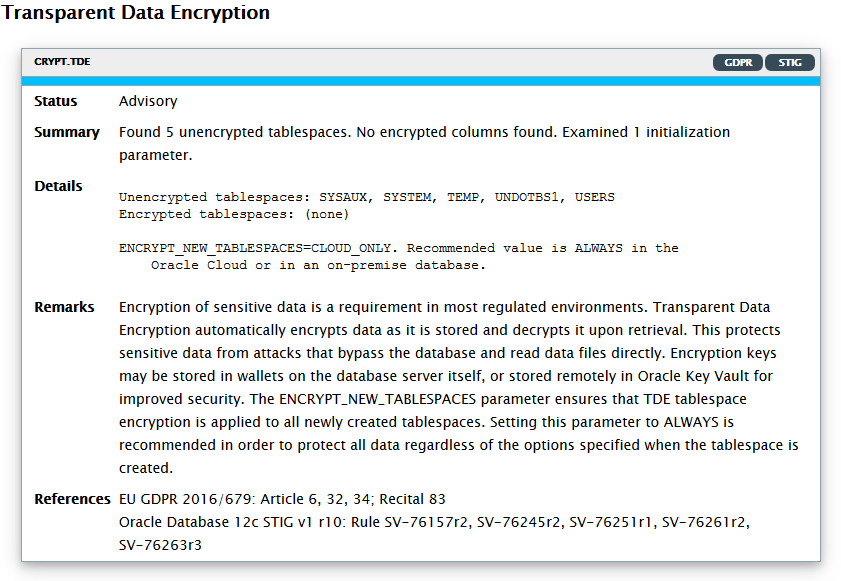

# Lab 3: Transparent Data Encryption

In this lab, we will address the problem of protecting against data theft or loss of disks and backups by encrypting all database files.

## Disclaimer ##

The following is intended to outline our general product direction. It is intended for information purposes only, and may not be incorporated into any contract. It is not a commitment to deliver any material, code, or functionality, and should not be relied upon in making purchasing decisions. The development, release, and timing of any features or functionality described for Oracle’s products remains at the sole discretion of Oracle.

## Requirements

* **Lab 02: "Network Encryption"** completed.
* Session open to **secdb** with user **oracle**
* session open to **dbclient** with user **oracle**   

## Introduction  ##

In **Lab 01, DBSAT** we had the following finding:



**Transparent Data Encryption** automatically encrypts data as it is stored and decrypts it upon retrieval. This protects sensitive data from attacks that bypass the database to read data files directly. Encryption keys may be stored in wallets on the database server itself, or stored remotely in Oracle Key Vault for improved security. The ENCRYPT\_NEW\_TABLESPACES parameter ensures that TDE tablespace encryption is applied to all newly created tablespaces.

## Step 1: Configuring Transparent Data Encryption

A software keystore is a container that stores the Transparent Data Encryption master encryption key.
Before you can configure the keystore, you first must define a location for it.

In previous releases, the keystore location was specified in sqlnet.ora
(SQLNET.ENCRYPTION\_WALLET\_LOCATION).

In 19c, the best practice is to set the keystore location in instance parameter **wallet\_root**, always specified at the CDB level. This location can include environment variables, for example be set to **$ORACLE\_BASE/admin/$ORACLE\_SID/wallet**. (A subdirectory **tde** will be added to this path.) The instance must be restarted after setting **wallet\_root**.

The **type** of keystore (file, HSM, Oracle Key Vault) is then specified in  another instance parameter (**tde\_encryption**).

19c allows to create a shared keystore for the CDB and all its PDBs (**UNIFIED** mode) or a per-PDB keystore (**ISOLATED** mode).

* To create a single keystore, specify **tde\_encryption** at the CDB level and restart the database.
* To create a per-PDB keystore, specify **tde\_encryption** for each PDB after having set **wallet\_location** and restarted the database. Also restart the PDB after setting **tde\_encryption**.


### Setting a location for the Wallet (TDE keystore)

Run the following script from a terminal window to the **secdb** server:

````
[oracle@secdb lab03_tde]$ <copy>cd ~/HOL/lab03_tde/</copy>
````

````
[oracle@secdb lab03_tde]$ <copy>tde10_create_keystore_rootdir.sh</copy>

[oracle@secdb lab03_tde]$ tde10_create_keystore_rootdir.sh
mkdir -p /u01/oracle/db/admin/CONT/wallet
````

### Setting wallet\_root

Run the following script from a terminal window to the **secdb** server:

````
[oracle@secdb lab03_tde]$ <copy>tde11_set_wallet_root.sh</copy>

(...)
SQL> -- set wallet_root
SQL> alter system set wallet_root='$ORACLE_BASE/admin/$ORACLE_SID/wallet' scope=spfile;
System altered.

SQL> --
SQL> -- restart the instance
SQL> --
SQL> shutdown immediate
Database closed.
Database dismounted.
ORACLE instance shut down.
SQL> startup
ORACLE instance started.
(...)

SQL> show parameter wallet_root
NAME                     TYPE        VALUE
------------------------ ----------- ------------------------------
wallet_root              string      /u01/oracle/db/admin/CONT/wallet
(...)
````

### Setting tde\_encryption

Run the following script from a terminal window to the **secdb** server:

````
[oracle@secdb lab03_tde]$ <copy>tde12_set_tde_encryption.sh</copy>

(...)
SQL> --
SQL> -- UNITED mode TDE keystore configuration (shared keystore)
SQL> --
SQL>
SQL> -- set tde_encryption
SQL> alter system set tde_configuration="KEYSTORE_CONFIGURATION=FILE" scope=both;
System altered.

SQL> --
SQL> -- restart the instance
SQL> --
SQL> shutdown immediate
Database closed.
Database dismounted.
ORACLE instance shut down.
SQL> startup
ORACLE instance started.
(...)

SQL> show parameter wallet_root
NAME                        TYPE        VALUE
--------------------------- ----------- ------------------------------
wallet_root                 string      /u01/oracle/db/admin/CONT/wallet

SQL> show parameter tde_configuration
NAME                        TYPE        VALUE
--------------------------- ----------- ------------------------------
tde_configuration           string      KEYSTORE_CONFIGURATION=FILE
(...)
````


### Creating the Keystore

Run the following script from a terminal window to the **secdb** server:

````
[oracle@secdb lab03_tde]$ <copy>tde20_keystore_create.sh</copy>

(...)
SQL> --
SQL> -- create the keystore
SQL> --
SQL> administer key management
  2    create keystore identified by "MyWalletPwd#1";
keystore altered.

SQL> --
SQL> -- open the keystore
SQL> --
SQL> administer key management
  2    set keystore open identified by "MyWalletPwd#1"
  3    container=all;
keystore altered.

SQL> --
SQL> -- view keystore status
SQL> --
SQL> connect / as sysdba
Connected.
SQL> set echo on
SQL> select con_id, keystore_mode, wallet_type, status from v$encryption_wallet;

    CON_ID KEYSTORE WALLET_TYPE          STATUS
---------- -------- -------------------- ------------------------------
         1 NONE     PASSWORD             OPEN_NO_MASTER_KEY
         2 UNITED   PASSWORD             OPEN_NO_MASTER_KEY
         3 UNITED   PASSWORD             OPEN_NO_MASTER_KEY
(...)
````
As shown above, the wallet is created as password protected, but is still empty for the CDB and all PDBs.


### Creating Master Keys

Run the following script from a terminal window to the **secdb** server:

````
[oracle@secdb lab03_tde]$ <copy>tde30_create_master_keys.sh</copy>

(...)
SQL> --
SQL> -- create master encryption keys for CDB/PDBs and activate them
SQL> --
SQL> administer key management
  2    set key identified by "MyWalletPwd#1"
  3    with backup using 'backup'
  4    container=all;
keystore altered.

SQL> --
SQL> -- view keystore status
SQL> --
SQL> connect / as sysdba
Connected.
SQL> set echo on
SQL> select con_id, keystore_mode, wallet_type, status from v$encryption_wallet;

    CON_ID KEYSTORE WALLET_TYPE          STATUS
---------- -------- -------------------- ------------------------------
         1 NONE     PASSWORD             OPEN
         2 UNITED   PASSWORD             OPEN
         3 UNITED   PASSWORD             OPEN
(...)
````

As shown above, the wallet is now open and a TDE master key has been created for PDB1.

### Configure The Wallet as **auto-login** for Ease of Management

A **LOCAL AUTO-LOGIN** keystore might be a good tradeoff between security and ease of management. Run the following script from a terminal window to the **secdb** server:

````
[oracle@secdb lab03_tde]$ <copy>tde40_wallet_autologin.sh</copy>

(...)
SQL> --
SQL> -- make keystore LOCAL AUTO_LOGIN
SQL> --
SQL> administer key management
  2    create local auto_login keystore
  3    from keystore
  4    identified by "MyWalletPwd#1";
keystore altered.

SQL> --
SQL> -- reset wallet from PASSWORD to AUTOLOGIN mode
SQL> --
SQL> administer key management
  2    set keystore close identified by "MyWalletPwd#1"
  3    container=all;
keystore altered.

SQL> --
SQL> -- view keystore status
SQL> --
SQL> connect / as sysdba
Connected.
SQL> set echo on
SQL> select con_id, keystore_mode, wallet_type, status from v$encryption_wallet;

    CON_ID KEYSTORE WALLET_TYPE          STATUS
---------- -------- -------------------- ------------------------------
         1 NONE     LOCAL_AUTOLOGIN      OPEN
         2 UNITED   LOCAL_AUTOLOGIN      OPEN
         3 UNITED   LOCAL_AUTOLOGIN      OPEN
(...)
````

## Step 2: Encrypting Existing Data Files

We can now encrypt existing tablespaces.
Starting with Oracle Database 19c, the best practice is as follows:

For a PDB:
* encrypt all application tablespaces
* encrypt SYSTEM and SYSAUX
* do not encrypt TEMP and UNDO as all data that is stored there will be already encrypted

For CDB$ROOT:
* do not encrypt SYSTEM, SYSAUX, TEMP or UNDO. SYSTEM and SYSAUX tablespaces in a root are different from SYSTEM and SYSAUX in a PDB ... and should not contain any sensitive data that is processed in the PDBs.


### Encrypting Existing tablespaces

Run the following script from a terminal window to the **secdb** server:

````
[oracle@secdb lab03_tde]$ <copy>tde50_encrypt_ts.sh</copy>

(...)
SQL> alter session set container=pdb1;
Session altered.

SQL> select tablespace_name, encrypted from dba_tablespaces;
TABLESPACE_NAME                ENC
------------------------------ ---
SYSTEM                         NO
SYSAUX                         NO
UNDOTBS1                       NO
TEMP                           NO
USERS                          NO

SQL> -- create a new encrypted tablespace
SQL> create tablespace enc_data encryption using 'AES128' default storage(encrypt);
Tablespace created.

SQL> -- 12cR2 allows online encryption of existing user tablespaces
SQL> alter tablespace users encryption online encrypt;
Tablespace altered.

SQL> -- SYSTEM and SYSAUX encryption fully supported from 19c on
SQL> alter tablespace SYSTEM encryption online encrypt;
Tablespace altered.

SQL> alter tablespace SYSAUX encryption online encrypt;
Tablespace altered.

SQL> -- check which tablespaces have been encrypted
SQL> select tablespace_name, encrypted from dba_tablespaces;
TABLESPACE_NAME                ENC
------------------------------ ---
SYSTEM                         YES
SYSAUX                         YES
UNDOTBS1                       NO
TEMP                           NO
USERS                          YES
ENC_DATA                       YES
6 rows selected.
(...)
````


## Step 3: Working with Wallet

### Inspect keys in the Wallet

You may want to inspect existing keys in the TDE wallet.
Run the following script from a terminal window to the **secdb** server:

````
[oracle@secdb lab03_tde]$ <copy>tde70_inspect_keys.sh</copy>

(...)
SQL> alter session set container=cdb$root;
Session altered.

SQL> select pdb.name pdb, e.key_id,
  2  to_char(e.creation_time,'DD-MON-YY HH24:MI:SS') created,
  3  to_char(e.activation_time,'DD-MON-YY HH24:MI:SS') activated,
  4  e.creator ,
  5  e.activating_pdbname acted_from
  6  from v$encryption_keys e, v$pdbs pdb
  7  where pdb.con_id=e.con_id and pdb.dbid = e.activating_pdbuid
  8  order by pdb.name desc, created ;

PDB        KEY_ID                                                CREATED            ACTIVATED          CREATOR      ACTED_FROM
---------- ----------------------------------------------------- ------------------ ------------------ ------------ ------------
PDB1       AdpQ/ENA5k/7v4TdZMwRJSUAAAAAAAAAAAAAAAAAAAAAAAAAAAAA  24-JUL-20 12:43:08 24-JUL-20 12:43:08 SYSKM        PDB1
(...)
````

### Rotating TDE Master Keys

Occasionally you may need to replace the TDE master encryption key by a new one and re-encrypt all local keys at the tablespace or table levels (with the new key). This operation is called **rotating** the key.

Rotate the master encryption key only if it was compromised or as per the security policies of the organization (for example once a year). This process deactivates the previous TDE master encryption key.

Do not perform a rotation operation of the master key concurrently with an online tablespace rekey operation.

If you want to rotate the TDE master key, run the following script from a terminal window to the **secdb** server:

````
[oracle@secdb lab03_tde]$ <copy>tde80_rotate_keys.sh</copy>

(...)
SQL> administer key management set keystore open force keystore identified by "MyWalletPwd#1" container=all;
keystore altered.

SQL> administer key management set encryption key
  2  using tag 'newkey'
  3  force keystore identified by "MyWalletPwd#1"
  4  with backup using 'pre_newkey'
  5  container=all;
keystore altered.
(...)
````

The **with backup** clause means that the **previous keystore** is backed up before the new TDE key is added.

````
[oracle@secdb lab03_tde]$ <copy>cd $ORACLE_BASE/admin/$ORACLE_SID/wallet/tde</copy>
````

````
[oracle@secdb lab03_tde]$ <copy>ls -l</copy>

[oracle@secdb lab03_tde]$ cd $ORACLE_BASE/admin/$ORACLE_SID/wallet/tde
[oracle@secdb tde]$ ll
total 36
-rw-------. 1 oracle oinstall 8408 Jul 24 14:59 cwallet.sso
-rw-------. 1 oracle oinstall 2555 Jul 24 14:43 ewallet_2020072412430787_backup.p12
-rw-------. 1 oracle oinstall 5467 Jul 24 14:59 ewallet_2020072412594996_pre_newkey.p12
-rw-------. 1 oracle oinstall 8347 Jul 24 14:59 ewallet.p12
````

The presence of cwallet.sso indicates an **auto-login wallet**.

This completes the **Transparent Data Encryption** lab. You can continue with **Lab 4: Data Redaction**


## Acknowledgements ##

- **Authors** - Adrian Galindo, PTS LAD & François Pons, PTS EMEA - Database Product Management - May 2020.
- **Credits** - This lab is based on materials provided by Oracle Database Security Product Management.
