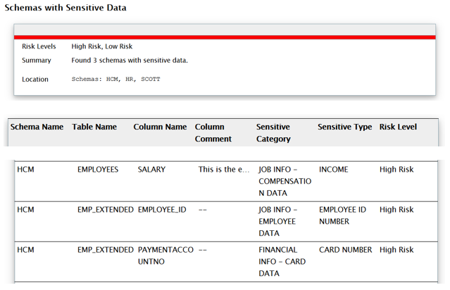

# Lab 4: Data Redaction

Oracle Data Redaction enables you to move redaction capabilities out of applications and into the database. It provides an easy way protect sensitive information that is displayed in applications by replacing it on-the-fly with valid redacted data, while keeping the applications running. Sensitive information is concealed according to flexible polices that provide conditional redaction and that are managed directly within the database. For maximum transparency, redaction preserves the type and formatting of column data returned to applications, and it does not alter the underlying database blocks on disk or in cache. Oracle Data Redaction is designed to be fast so that it can run on production systems. Oracle Data Redaction enables you to mask (redact) data that is returned from queries issued by low-privileged users or applications. 

You can redact column data by using one of the following methods:

- **Full redaction**. You redact all the contents of the column data. The redacted value returned to the querying user depends on the data type of the column. For example, columns of the NUMBER data type are redacted with a zero (0) and character data types are redacted with a blank space.
- **Partial redaction**. You redact a portion of the column data. For example, you can redact most of a Social Security number with asterisks (*), except for the last four digits.
- **Regular expressions**. You can use regular expressions in both full and partial redaction. This enables you to redact data based on a search pattern for the data. For example, you can use regular expressions to redact specific phone numbers or email addresses in your data.
- **Random redaction**. The redacted data presented to the querying user appears as randomly-generated values each time it is displayed, depending on the data type of the column.
- **No redaction**. This option enables you to test the internal operation of your redacting policies, with no effect on the results of queries against tables with policies defined on them. You can use this option to test the redaction policy definitions before applying them to a production environment.

Oracle Database applies the redaction at run time, at the moment users attempt to access the data (that is, at query-execution time). This solution works well in a dynamic production system in which data is constantly changing. During the time that the data is being redacted, all data processing is performed normally, and the back-end referential integrity constraints are preserved.  

Data redaction can help you to comply with industry regulations such as Payment Card Industry Data Security Standard (PCI DSS) and the Sarbanes-Oxley Act.

Redaction can be implemented via Enterprise Manager (which benefits from pre-defined redaction templates), SQL\*Developer and via the PL/SQL API (so SQL\*Plus or other client).

- **Lab 03: "Transparent Data Encryption"** completed. 
- Session open to **secdb** with user **oracle**
- session open to **dbclient** with user **oracle**   

## Creating a Simple Redaction Policy

### Requirements

DBSAT had identified a number of sensitive columns HCM schema:



Let us create simple redaction policies for low privileged users on these three columns. 

## Step 1: Create a low privileged user

Run the following script from a terminal window to the **secdb** server to create a low privileged user `hcm_clerk`:

```
[oracle@secdb ~]$ <copy>cd /home/oracle/HOL/lab04_redaction/ ;</copy>
[oracle@secdb lab04_redaction]$ <copy>./redac10_create_user.sh</copy>

SQL*Plus: Release 19.0.0.0.0 - Production on Tue May 12 19:55:46 2020
Version 19.6.0.0.0

Copyright (c) 1982, 2019, Oracle.  All rights reserved.

Connected.
SQL>
SQL> --drop user hcm_clerk cascade;
SQL> create user hcm_clerk identified by MyDbPwd#1 account unlock;

User created.

SQL> grant connect, resource, unlimited tablespace to hcm_clerk;

Grant succeeded.

SQL>
SQL> grant select on HCM.regions to hcm_clerk;

Grant succeeded.

SQL> grant select on HCM.countries to hcm_clerk;

Grant succeeded.

SQL> grant select on HCM.locations to hcm_clerk;

Grant succeeded.

SQL> grant select on HCM.departments to hcm_clerk;

Grant succeeded.

SQL> grant select on HCM.jobs to hcm_clerk;

Grant succeeded.

SQL> grant select on HCM.employees to hcm_clerk;

Grant succeeded.

SQL> grant select on HCM.emp_extended to hcm_clerk;

Grant succeeded.

SQL> grant select on HCM.job_history to hcm_clerk;

Grant succeeded.

SQL>
SQL> exit
Disconnected from Oracle Database 19c Enterprise Edition Release 19.0.0.0.0 - Production
Version 19.6.0.0.0
[oracle@secdb lab04_redaction]$
```

## Step 2: Create a redaction policy

Run the following script from a terminal window to the **secdb** server:

```
[oracle@secdb lab04_redaction]$ <copy>./redac20_add_pol.sh</copy>

SQL*Plus: Release 19.0.0.0.0 - Production on Tue May 12 19:59:33 2020
Version 19.6.0.0.0

Copyright (c) 1982, 2019, Oracle.  All rights reserved.

Connected.
SQL>
SQL> --
SQL> -- Full redaction of HCM.EMPLOYEES.SALARY except for HCM
SQL> --
SQL> BEGIN
  2  DBMS_REDACT.ADD_POLICY (
  3    object_schema => 'HCM',
  4    object_name      => 'EMPLOYEES',
  5    policy_name      => 'REDACT_EMPLOYEES',
  6    column_name      => 'SALARY',
  7    function_type => DBMS_REDACT.FULL,
  8    expression       => 'SYS_CONTEXT ( ''USERENV'',''SESSION_USER'' ) != ''HCM''',
  9    enable        => TRUE
 10    );
 11  END;
 12  /

PL/SQL procedure successfully completed.

SQL> show errors
No errors.
SQL> --
SQL> -- Partial redaction of HCM.EMP_EXTENDED.TAXPAYERID except for HCM
SQL> --
SQL> BEGIN
  2  DBMS_REDACT.ADD_POLICY (
  3    object_schema       => 'HCM',
  4    object_name         => 'EMP_EXTENDED',
  5    policy_name         => 'REDACT_EMP_EXTENDED',
  6    column_name         => 'TAXPAYERID',
  7    function_type       => DBMS_REDACT.PARTIAL,
  8    function_parameters => 'VVVFVVFVVVV,VVV-VV-VVVV,X,1,5',
  9    expression          => 'SYS_CONTEXT ( ''USERENV'',''SESSION_USER'' ) != ''HCM''',
 10    enable              => TRUE
 11    );
 12  END;
 13  /

PL/SQL procedure successfully completed.

SQL> show errors
No errors.
SQL> --
SQL> -- Partial redaction of HCM.EMP_EXTENDED.PAYMENTACCOUNTNO except for HCM
SQL> --
SQL> BEGIN
  2  DBMS_REDACT.ALTER_POLICY (
  3    object_schema       => 'HCM',
  4    object_name         => 'EMP_EXTENDED',
  5    policy_name         => 'REDACT_EMP_EXTENDED',
  6    column_name         => 'PAYMENTACCOUNTNO',
  7    action              => DBMS_REDACT.ADD_COLUMN,
  8    function_type       => DBMS_REDACT.PARTIAL,
  9    function_parameters => 'VVVVVVVVVVVVVVVV,VVVVVVVVVVVVVVVV,X,1,12'
 10  );
 11  END;
 12  /

PL/SQL procedure successfully completed.

SQL> show errors
No errors.
SQL>
SQL> exit
Disconnected from Oracle Database 19c Enterprise Edition Release 19.0.0.0.0 - Production
Version 19.6.0.0.0
[oracle@secdb lab04_redaction]$

```

This completes the **Data Redaction** lab. You can continue with **Lab 5: Privilege Analysis**

## Acknowledgements

- **Authors** - Adrian Galindo, PTS LAD & François Pons, PTS EMEA - Database Product Management - May 2020.
- **Credits** - This lab is based on materials provided by Oracle Database Security Product Management.