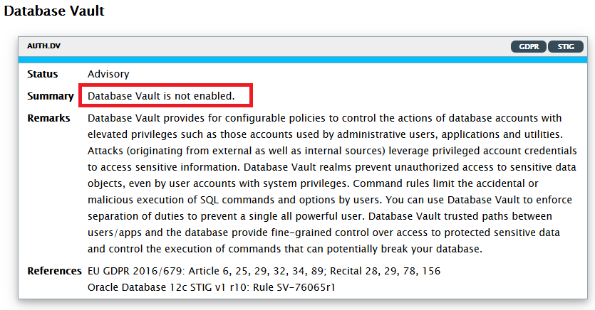

# Lab 6: Database Vault

In many cases, it is no longer acceptable that over-privileged users (e.g. DBAs) see sensitive data in the system they manage. For instance, DBAs managing a health care system should not be able to see patients data. In this chapter, we will see how Database Vault can enforce these rules.

## Disclaimer ##
The following is intended to outline our general product direction. It is intended for information purposes only, and may not be incorporated into any contract. It is not a commitment to deliver any material, code, or functionality, and should not be relied upon in making purchasing decisions. The development, release, and timing of any features or functionality described for Oracle’s products remains at the sole discretion of Oracle.

## Requirements ##

Instructions in this lab expect that you have completed all the previous labs in the workshop.

## Introduction  ##

Many regulations require that privileged users such as DBAs be not able to read sensitive data in the database.
Oracle Database Vault provides this kind of control, which prevent unauthorized privileged users from accessing sensitive data. It can also prevent unauthorized database changes.
DBSAT has detected that Database Vault was not yet is use in our database.



In this chapter, we will configure Database Vault for both the Container Database **CONT** and **PDB1**.

## Step 1 : Configure Database Vault ##

### Step 1a : Enable Database Vault in the Container Database ###

We first create (as **SYS**) the common users which will become the **Database Vault Owner** and the **Database Vault Account Manager** and then call **configure_dv** to configure Database Vault.

Run the following script from a terminal window to the secdb server.

````
[oracle@secdb ~]$ <copy>cd /home/oracle/HOL/lab06_dbv/a_setup</copy>
````

````
[oracle@secdb a_setup]$ <copy>dbvsetup10_config.sh</copy>

(...)
SQL> --
SQL> -- create users
SQL> --
SQL> grant create session, set container to c##dbvo identified by "_c2h5oh_" container=all;
Grant succeeded.
SQL> grant create session, set container to c##dbvam identified by "_c2h5oh_" container=all;
Grant succeeded.
SQL> --
SQL> -- Configure Database Vault as SYS at CDB level
SQL> --
SQL> begin
  2    dvsys.configure_dv(
  3      dvowner_uname     => 'C##DBVO',
  4      dvacctmgr_uname   => 'C##DBVAM');
  5  end;
  6  /
PL/SQL procedure successfully completed.
(...)
````

We now need to **enable** Database Vault in the CDB.

````
[oracle@secdb a_setup]$ <copy>dbvsetup11_enable.sh</copy>

(...)
SQL> begin
  2    dbms_macadm.enable_dv;
  3  end;
  4  /
PL/SQL procedure successfully completed.
(...)
````

Finally we need to **restart** the instance.

````
[oracle@secdb a_setup]$ <copy>dbvsetup12_restart.sh</copy>

(...)
SQL> shutdown immediate
Database closed.
Database dismounted.
ORACLE instance shut down.
SQL> startup
ORACLE instance started.
(...)

SQL> -- Control status
SQL> select parameter, value from v$option where parameter = 'Oracle Database Vault';

PARAMETER
---------
VALUE
-----
Oracle Database Vault
TRUE
````

### Step 1b : Enable Database Vault in the Pluggable Database ###

We need to run similar scripts for the pluggable database **PDB1**.

Create common users to become the **Database Vault Owner** and the **Database Account Manager**.

````
[oracle@secdb a_setup]$ <copy>dbvsetup20_configPDB1.sh</copy>

(...)
SQL> alter session set container=pdb1;
Session altered.

SQL> --
SQL> -- grant privileges
SQL> --
SQL> grant create session, set container to c##dbvo;
Grant succeeded.

SQL> grant create session, set container to c##dbvam;
Grant succeeded.

SQL> --
SQL> -- Configure Database Vault as SYS
SQL> --
SQL> begin
  2    dvsys.configure_dv(
  3      dvowner_uname     => 'C##DBVO',
  4      dvacctmgr_uname   => 'C##DBVAM');
  5  end;
  6  /
PL/SQL procedure successfully completed.
(...)
````

**Enable** Database Vault in PDB1.

````
[oracle@secdb a_setup]$ <copy>dbvsetup21_enablePDB1.sh</copy>

(...)
SQL> begin
  2    dbms_macadm.enable_dv;
  3  end;
  4  /
PL/SQL procedure successfully completed.
(...)
````

**Restart** PDB1.

````
[oracle@secdb a_setup]$ <copy>dbvsetup22_restartPDB1.sh</copy>

(...)
SQL> alter session set container=pdb1;
Session altered.

SQL> alter pluggable database pdb1 close immediate;
Pluggable database altered.

SQL> alter pluggable database pdb1 open;
Pluggable database altered.

SQL> -- Control status
SQL> select parameter, value from v$option where parameter = 'Oracle Database Vault';

PARAMETER
---------
VALUE
-----
Oracle Database Vault
TRUE
(...)
````


## Step 2 : Operations Control  ##

**Operations Control** is a Database Vault **19c** new feature which makes very easy to restrict common users (e.g. **SYS** or **SYSTEM**) from accessing pluggable database local data (e.g. **PDB1** local data).

Ops Control is useful for situations where a database administrator must log in to the CDB root as a highly privileged user, but still not be able to access PDB customer data.

Database operations control does not block PDB database administrators. To block these users, enable Oracle Database Vault in the PDB and then use other Database Vault features such as **realm control** to block these users, as we'll see in **Step 3**.

Run the following script to enable Ops Control in the CDB.

````
[oracle@secdb ]$ <copy>cd /home/oracle/HOL/lab06_dbv/b_ops_control</copy>
````

````
[oracle@secdb b_ops_control]$ <copy>opsctl_10_enable.sh</copy>

(...)
SQL*Plus: Release 19.0.0.0.0 - Production on Tue May 12 14:33:47 2020
Version 19.6.0.0.0

SQL> begin
  2          dbms_macadm.enable_app_protection;
  3  end;
  4  /
PL/SQL procedure successfully completed.
(...)
````

Verify the status (**DV\_APP\_PROTECTION** is **ENABLED**).

````
[oracle@secdb b_ops_control]$ <copy>opsctl_20_status.sh</copy>

(...)
SQL> select * from dba_dv_status;

NAME                 STATUS
-------------------- --------------------
DV_APP_PROTECTION    ENABLED
DV_CONFIGURE_STATUS  TRUE
DV_ENABLE_STATUS     TRUE

(...)
````

Let us now verify that **SYS** or **SYSTEM** cannot access local data in **PDB1**.

````
[oracle@secdb b_ops_control]$ <copy>opsctl_30_test_access.sh</copy>

(...)
SQL> connect system/"MyDbPwd#1"@secdb/pdb1
Connected.
SQL> select * from hr.regions;
select * from hr.regions
                 *
ERROR at line 1:
ORA-01031: insufficient privileges

SQL> select * from scott.dept;
select * from scott.dept
                    *
ERROR at line 1:
ORA-01031: insufficient privileges

SQL> -- Testing access from SYS
SQL> connect sys/"MyDbPwd#1"@secdb/pdb1 as sysdba
Connected.
SQL> col country_name for a20
SQL> select * from hcm.countries where rownum <6;
select * from hcm.countries where rownum <6
                  *
ERROR at line 1:
ORA-01031: insufficient privileges
(...)
````

For the rest of the workshop, we will however **disable Operations Control**. Please run the following script.

````
[oracle@secdb b_ops_control]$ <copy>opsctl_90_disable.sh</copy>

(...)
SQL> begin
  2          dbms_macadm.disable_app_protection;
  3  end;
  4  /

PL/SQL procedure successfully completed.
(...)
````


## Step 3 : Create a Database Vault Realm over HR schema in PDB1  ##

A **realm** is a grouping of database schemas, database objects, and database roles that must be secured for a given application. Only users who have been granted **realm authorization** as either a realm **owner** or a realm **participant** can use their **system privileges** to access secured objects in the realm.

In the following demo, we will execute the following scenario:

*	Create  a realm over the **HR** schema in **PDB1** – done by the Database Vault Owner
*	Create a **HR_ROLE** role to grant application privileges to users. We’ll need to also protect this role by putting in inside the realm to prevent privileged users (**SYS** or **SYSTEM**) to modify it or to grant it to themselves
*	We’ll also create two application users **appuser1** and **appuser2** and grant the required role only to **appuser1**

### Step 3a : Create a realm HR_REALM over the HR schema ###

Create realm **HR_REALM** over the **HR** schema in **PDB1**. Run the following script from a terminal window to the secdb server

````
[oracle@secdb ]$ <copy>cd /home/oracle/HOL/lab06_dbv/b_realm</copy>
````

````
[oracle@secdb b_realm]$ <copy>dbv10_dbvo_realm.sh</copy>

(...)
SQL> /*
SQL>  * Create a mandatory realm to protect schema HR
SQL>  */
SQL> BEGIN
  2    DBMS_MACADM.CREATE_REALM(
  3      realm_name    => 'HR Realm',
  4      description   => 'This mandatory realm protects schema HR',
  5      enabled       => 'Y',
  6      audit_options => '1',
  7      realm_type    =>'1' );
  8    DBMS_MACADM.ADD_OBJECT_TO_REALM(
  9      realm_name    => 'HR Realm',
 10      object_owner  => 'HR',
 11      object_name   => '%',
 12      object_type   => '%' );
 13    DBMS_MACADM.ADD_AUTH_TO_REALM(
 14      realm_name    => 'HR Realm',
 15      grantee       => 'HR',
 16      rule_set_name => '',
 17      auth_options  => DBMS_MACUTL.G_REALM_AUTH_OWNER );
 18  END;
 19  /
PL/SQL procedure successfully completed.
(...)
````

### Step 3b : Grant CREATE ROLE to the Application Manager ###

It is important to not create the role as **SYS**, but as the **Application Manager**. Otherwise the DBA will be able to later modify the role or grant it to himself. Run the following script from a terminal window to the secdb server:

````
[oracle@secdb ]$ <copy>cd /home/oracle/HOL/lab06_dbv/c_role</copy>
````

````
[oracle@secdb c_role]$ <copy>dbv20_sys_grant.sh</copy>

(...)
SQL> alter session set container=PDB1;
Session altered.

SQL> /*
SQL>  * Role will be created by HR and protected in the realm
SQL>  * => cannot be modified by DBAs
SQL>  */
SQL> grant create role to HR;
Grant succeeded.
(...)
````

### Step 3c : Create demo users ###

Run the following script.

````
[oracle@secdb c_role]$ <copy>dbv30_dbvam_create_users.sh</copy>

(...)
SQL> --
SQL> -- Need to be DBVAM to create users and grant CONNECT
SQL> --
SQL> create user appuser1 identified by MyDbPwd#1 account unlock;
User created.

SQL> create user appuser2 identified by MyDbPwd#1 account unlock;
User created.

SQL> grant create session to appuser1;
Grant succeeded.

SQL> grant create session to appuser2;
Grant succeeded.
(...)
````

### Step 3d :  Create an application role ###

Connect as the **Application Manager (HR)** to create the application role **APPROLE**. Run the following script from a terminal window to the secdb server. Note that the role is only granted to **APPUSER1** and not to **APPUSER2**.

````
[oracle@secdb c_role]$ <copy>dbv40_hr_roleprivs.sh</copy>

(...)
SQL> create role APPROLE;
Role created.

SQL> grant select, insert, update, delete on HR.regions to APPROLE;
Grant succeeded.

SQL> grant select, insert, update, delete on HR.countries to APPROLE;
Grant succeeded.

SQL> grant select, insert, update, delete on HR.locations to APPROLE;
Grant succeeded.

(...)

SQL> grant select, insert, update, delete on HR.job_history to APPROLE;
Grant succeeded.

SQL> grant execute on hr.ADD_JOB_HISTORY to APPROLE;
Grant succeeded.

SQL> grant execute on hr.SECURE_DML to APPROLE;
Grant succeeded.

SQL> grant APPROLE to appuser1;
Grant succeeded.
(...)
````

### Step 3e :  Protect the APPROLE role ###

Protect role APPROLE by placing it in the realm to prevent privileged users such as DBAs from granting the role to themselves.

Please note that because we created a **mandatory** realm, we also need to make it realm **participant** in order to allow users granted this role to use their privileges.

````
[oracle@secdb c_role]$ <copy>dbv50_dbvo_approle.sh</copy>

(...)
SQL> /*
SQL>  * Protects role APPROLE
SQL>  * - putting role APPROLE in the realm prevents DBA from granting the role to themselves
SQL>  * - putting role APPROLE as realm participant allows users granted this role to use their privileges
SQL>  */
SQL> BEGIN
  2    DBMS_MACADM.ADD_OBJECT_TO_REALM(
  3      realm_name      => 'HR Realm',
  4      object_owner    => '%',
  5      object_name     => 'APPROLE',
  6      object_type     => 'ROLE' );
  7    DBMS_MACADM.ADD_AUTH_TO_REALM(
  8      realm_name      => 'HR Realm',
  9      grantee         => 'APPROLE',
 10      rule_set_name   => '',
 11      auth_options    => DBMS_MACUTL.G_REALM_AUTH_PARTICIPANT );
 12  END;
 13  /
PL/SQL procedure successfully completed.
(...)
````

### Step 3f : Verification ###

We can now test from the dbclient client that only **APPUSER1** (and not **APPUSER2**) is able to run the application. Run the following script from a terminal window to the **dbclient** client.

First from APPUSER1 :

````
[oracle@dbclient ~]$ <copy>cd /home/oracle/HOL/lab06_dbv</copy>
````

````
[oracle@dbclient lab06_dbv]$ <copy>run_applic_appuser1.sh</copy>

(...)
SQL> select * from hr.regions;

 REGION_ID REGION_NAME
---------- -------------------------
         1 Europe
         2 Americas
         3 Asia
         4 Middle East and Africa
(...)
````


Then from APPUSER2 :

````
[oracle@dbclient lab06_dbv]$ <copy>run_applic_appuser2.sh</copy>

(...)
SQL> select * from hr.regions;
select * from hr.regions
                 *
ERROR at line 1:
ORA-00942: table or view does not exist
(...)
````

## Step 4 : Using Database Vault to enforce a trusted application path  ##

In Oracle Database Vault, you can create a **Secure Application Role** that you enable with an Oracle Database Vault rule set.

Regular Oracle Database Secure Application Roles are enabled by custom PL/SQL procedures. You use Secure Application Roles to prevent users from accessing data from outside an application. This forces users to work within the framework of the application privileges that have been granted to the role.

The advantage of basing database access for a role on a rule set is that you can store database security policies in one central place, as opposed to storing them in all your applications. Basing the role on a rule set provides a consistent and flexible method to enforce the security policies that the role provides. In this way, it is easy to enforce a trusted application path and reject all unexpected connections.

In the following demo, we will allow connection as APPUSER2, but only when they come from **SQL*Plus** and from the **dbclient** client.

Here is the outline of the configuration :
*	Create **rules** to check a connection comes from **SQL*Plus** and from **dbclient**
*	Group the rules in a **rule set**
*	Create a **Secure Application Role** linked to this rule set
*	Grant privileges to the Secure Role
*	Test the Secure Application Role


### Step 4a : Create the rules ###

Execute the following commands from **secdb** to create three rules.

````
[oracle@secdb ~]$ <copy>cd /home/oracle/HOL/lab06_dbv/d_secapprole</copy>
````

````
[oracle@secdb d_secapprole]$ <copy>sar10_dbvo_rules.sh</copy>

(...)
SQL> /*
SQL>  * Create rules
SQL>  */
SQL> begin
  2    DBMS_MACADM.CREATE_RULE(
  3      rule_name   => 'Check host',
  4      rule_expr   => 'rtrim(SYS_CONTEXT(''USERENV'',''HOST''),''.localdomain'')=''dbclient'''
  5      );
  6  end;
  7  /
PL/SQL procedure successfully completed.

SQL> begin
  2    DBMS_MACADM.CREATE_RULE(
  3      rule_name   => 'Check program',
  4      rule_expr   => 'SYS_CONTEXT(''USERENV'',''MODULE'')=''SQL*Plus'''
  5      );
  6  end;
  7  /
PL/SQL procedure successfully completed.

SQL>
SQL> begin
  2    DBMS_MACADM.CREATE_RULE(
  3      rule_name   => 'Check user',
  4      rule_expr   => 'SYS_CONTEXT(''USERENV'',''SESSION_USER'')=''APPUSER2'''
  5      );
  6  end;
  7  /
PL/SQL procedure successfully completed.
(...)
````

### Step 4b : Create a rule set ###

````
[oracle@secdb d_secapprole]$ <copy>sar20_dbvo_ruleset.sh</copy>

(...)
SQL> /*
SQL>  * Create rule set which can be used to enforce a trusted path for the application
SQL>  */
SQL> BEGIN
  2    DBMS_MACADM.CREATE_RULE_SET(
  3      rule_set_name => 'Can run application',
  4      description   => 'This rule set enforces a trusted path for the application',
  5      enabled         => 'Y',
  6      eval_options    => 1,
  7      audit_options   => 1,
  8      fail_options    => 1,
  9      fail_message    => '',
 10      fail_code       => '',
 11      handler_options => 0,
 12      handler         => '',
 13      is_static       => FALSE);
 14    DBMS_MACADM.ADD_RULE_TO_RULE_SET(
 15      rule_set_name   => 'Can run application',
 16      rule_name       => 'Check host',
 17      rule_order      => '1',
 18      enabled         => 'Y');
 19    DBMS_MACADM.ADD_RULE_TO_RULE_SET(
 20      rule_set_name   => 'Can run application',
 21      rule_name       => 'Check program',
 22      rule_order      => '1',
 23      enabled         => 'Y');
 24    DBMS_MACADM.ADD_RULE_TO_RULE_SET(
 25      rule_set_name   => 'Can run application',
 26      rule_name       => 'Check user',
 27      rule_order      => '1',
 28      enabled         => 'Y');
 29  END;
 30  /
PL/SQL procedure successfully completed.
(...)
````

### Step 4c : Create a Secure Application Role ###

Now create the Secure Application Role linked to the ruleset. Also protect it by putting it into the realm.

````
[oracle@secdb d_secapprole]$ <copy>sar30_dbvo_secapprole.sh</copy>

(...)
SQL> /*
SQL>  * Create secure application role
SQL>  */
SQL> BEGIN
  2    DVSYS.DBMS_MACADM.CREATE_ROLE(
  3      role_name     => 'SECAPPROLE',
  4      enabled       => 'Y',
  5      rule_set_name => 'Can run application');
  6  END;
  7  /
PL/SQL procedure successfully completed.

SQL> show errors
No errors.
SQL>
SQL> /*
SQL>  * Protects role SECAPPROLE
SQL>  * - putting role SECAPPROLE in the realm prevents DBA from granting the role to themselves
SQL>  * - putting role SECAPPROLE as realm participant allows users granted this role to use their privileges
SQL>  */
SQL> BEGIN
  2    DBMS_MACADM.ADD_OBJECT_TO_REALM(
  3      realm_name      => 'HR Realm',
  4      object_owner    => '%',
  5      object_name     => 'SECAPPROLE',
  6      object_type     => 'ROLE' );
  7    DBMS_MACADM.ADD_AUTH_TO_REALM(
  8      realm_name      => 'HR Realm',
  9      grantee         => 'SECAPPROLE',
 10      rule_set_name   => '',
 11      auth_options    => DBMS_MACUTL.G_REALM_AUTH_PARTICIPANT );
 12  END;
 13  /
PL/SQL procedure successfully completed.
(...)
````

### Step 4d : Grant privileges to the Sec App Role ###

Grant the privileges required to run the application to the Secure Application Role.

````
[oracle@secdb d_secapprole]$ <copy>sar40_hr_roleprivs.sh</copy>

(...)
SQL> grant select, insert, update, delete on HR.regions to SECAPPROLE;
Grant succeeded.

SQL> grant select, insert, update, delete on HR.countries to SECAPPROLE;
Grant succeeded.

(...)

SQL> grant select on hr.emp_details_view to SECAPPROLE,
SQL> grant execute on hr.ADD_JOB_HISTORY to SECAPPROLE;
Grant succeeded.

SQL> grant execute on hr.SECURE_DML to SECAPPROLE;
Grant succeeded.
(...)
````

### Step 4e : Verification ###

We can now verify that it is not possible to connect as **APPUSER2** from **secdb**.

````
[oracle@secdb ]$ <copy>cd /home/oracle/HOL/lab06_dbv/d_secapprole</copy>
````

````
[oracle@secdb d_secapprole]$ <copy>test_secapprole_appuser2.sh</copy>

(...)
SQL> --
SQL> -- try to enable the secure application role
SQL> --
SQL> exec dbms_macsec_roles.set_role('SECAPPROLE')
BEGIN dbms_macsec_roles.set_role('SECAPPROLE'); END;

*
ERROR at line 1:
ORA-47305: Rule Set violation on SET ROLE (SECAPPROLE)
ORA-06512: at "DVSYS.DBMS_MACUTL", line 49
ORA-06512: at "DVSYS.DBMS_MACUTL", line 398
ORA-06512: at "DVSYS.DBMS_MACSEC", line 286
ORA-06512: at "DVSYS.ROLE_IS_ENABLED", line 4
ORA-06512: at "DVSYS.DBMS_MACSEC_ROLES", line 53
ORA-06512: at line 1

SQL> select * from hr.regions;
select * from hr.regions
                 *
ERROR at line 1:
ORA-00942: table or view does not exist
(...)
````

… but it works from **dbclient** :

````
[oracle@dbclient ]$ <copy>cd /home/oracle/HOL/lab06_dbv</copy>
````

````
[oracle@dbclient lab06_dbv]$ <copy>test_secapprole_appuser2.sh</copy>

(...)
SQL>
SQL> --
SQL> -- enable the secure application role
SQL> --
SQL> exec dbms_macsec_roles.set_role('SECAPPROLE')
PL/SQL procedure successfully completed.

SQL>
SQL> select * from hr.regions;

 REGION_ID REGION_NAME
---------- -------------------------
         1 Europe
         2 Americas
         3 Asia
         4 Middle East and Africa
(...)
````

Note: The scripts in subdirectory **z_cleanup** are for your information only. They document the SQL syntax to **remove** the Database Vault configuration that we have just built. **DO NOT RUN THESE SCRIPTS**.

This completes the **Database Vault** lab. You can continue with **Lab 7: Database Audit**

## Acknowledgements

- **Authors** - Adrian Galindo, PTS LAD & François Pons, PTS EMEA - Database Product Management - May 2020.
- **Credits** - This lab is based on materials provided by Oracle Database Security Product Management.
