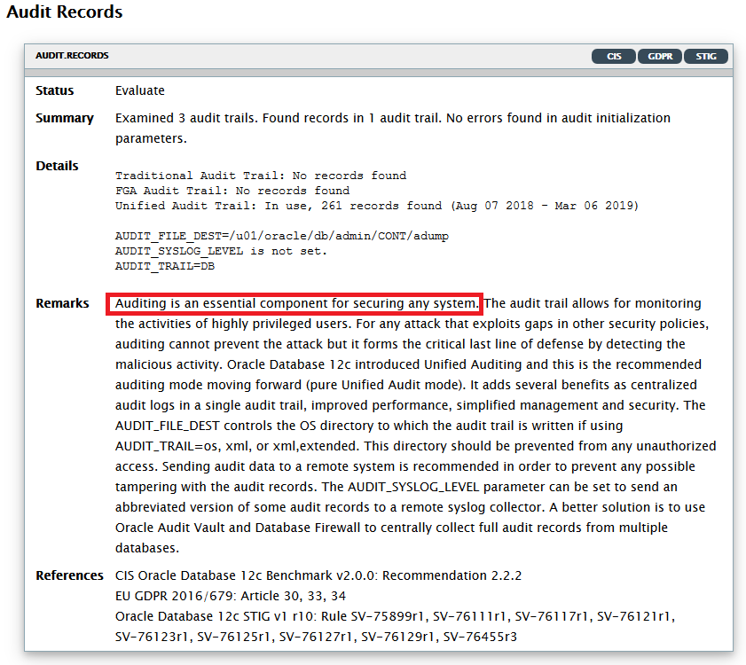
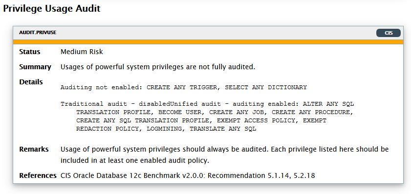

# Lab 7 - Unified Database Auditing #

In this chapter, we will address the problem of enforcing strong internal controls and meeting regulatory compliance by auditing the database.

## Disclaimer ##
The following is intended to outline our general product direction. It is intended for information purposes only, and may not be incorporated into any contract. It is not a commitment to deliver any material, code, or functionality, and should not be relied upon in making purchasing decisions. The development, release, and timing of any features or functionality described for Oracle’s products remains at the sole discretion of Oracle.


## Requirements ##
Instructions in this lab expect that you have completed all the previous labs in the workshop.

## Introduction  ##

DBSAT assessment has reported:



Also DBSAT made a number of other recommendations, like:



Auditing is an effective method of enforcing strong internal controls so that your site can meet its regulatory compliance requirements, as defined in the Sarbanes-Oxley Act or GDPR. This enables you to monitor business operations and find any activities that may deviate from company policy.

Traditionally, one can audit based on:

*	statement auditing e.g. AUDIT TABLE
*	privilege auditing (more focused) e.g. AUDIT CREATE TABLE
*	object auditing (very focused) e.g. AUDIT SELECT ON TAB_001

There are now three possible modes:

*	Traditional Auditing
*	Mixed Mode Auditing (default mode for since Oracle 12c)
*	Unified Auditing (which is the **recommended approach from 12cR2 on**)

When you create a new database, by default the database uses mixed mode auditing. Mixed mode auditing enables both traditional (that is, the audit facility from releases earlier than Release 12c) and the new audit facilities (unified auditing). It is possible to completely abandon traditional auditing and move to **pure unified auditing** mode by relinking the oracle executable.

In unified auditing, the **unified audit trail** captures audit information from a variety of sources.

*	Audit records (including SYS audit records) from unified audit policies and AUDIT settings
*	Fine-grained audit records from the DBMS_FGA PL/SQL package
*	Oracle Database Real Application Security audit records
*	Oracle Recovery Manager audit records
*	Oracle Database Vault audit records
*	Oracle Label Security audit records
*	Oracle Data Mining records
*	Oracle Data Pump
*	Oracle SQL*Loader Direct Load

## Step 1 : Configuring Unified Auditing ##

The unified audit trail, which resides in a read-only table in the AUDSYS schema in the SYSAUX tablespace, makes audit information available in a uniform format in the **UNIFIED\_AUDIT\_TRAIL** data dictionary view, and is available in both single-instance and Oracle Database Real Application Clusters environments. In addition to the user SYS, users who have been granted the **AUDIT\_ADMIN** and **AUDIT\_VIEWER** roles can query these views.

If your users only need to query the views but do not create audit policies, then grant them the **AUDIT\_VIEWER** role.

Run the following script from a terminal window to the secdb server to check its current auditing status:

````
$ <copy>cd /home/oracle/HOL/lab07_audit</copy>
````

````
$ <copy>aud_10_check.sh</copy>

(...)
SQL> SELECT VALUE FROM V$OPTION WHERE PARAMETER = 'Unified Auditing';

VALUE
----------------------------------------------------------------
FALSE
````

To configure Unified Auditing , we will first shutdown the database and its listener:

````
$ <copy>aud_20_shutdown.sh</copy>

(...)
SQL> Database closed.
Database dismounted.
ORACLE instance shut down.
(...)
````

Then we can relink the kernel, switching it to **pure unified auditing** (traditional auditing will be disabled).

````
$ <copy>aud_30_relink.sh</copy>

(...)
Linking Oracle
(...)
````

Restart database and listener.

````
$ <copy>aud_40_restart.sh</copy>
````

Let us verify that **pure Unified Auditing** has now been configured.

````
$ <copy>aud_10_check.sh</copy>

SQL*Plus: Release 18.0.0.0.0 - Production on Thu Mar 7 09:23:33 2019
Connected.

SQL> SELECT VALUE FROM V$OPTION WHERE PARAMETER = 'Unified Auditing';

VALUE
----------------------------------------------------------------
TRUE
````

## Step 2 : Check existing pre-created policies ##

Run the following script to list the pre-created unified auditing policies.

````
$ <copy>aud_50_check_policies.sh</copy>

SQL> select distinct policy_name from audit_unified_policies order by policy_name;

POLICY_NAME
-----------
ORA_ACCOUNT_MGMT
ORA_CIS_RECOMMENDATIONS
ORA_DATABASE_PARAMETER
ORA_DV_AUDPOL
ORA_DV_AUDPOL2
ORA_LOGON_FAILURES
ORA_RAS_POLICY_MGMT
ORA_RAS_SESSION_MGMT
ORA_SECURECONFIG
9 rows selected.
````

Check which ones of these policies are actually in use (enabled).

````
$ <copy>aud_60_enabled_policies.sh</copy>

SQL> select POLICY_NAME from AUDIT_UNIFIED_ENABLED_POLICIES;

POLICY_NAME
-----------
ORA_SECURECONFIG
ORA_LOGON_FAILURES

SQL> alter session set container=PDB1;
Session altered.

SQL> select POLICY_NAME from AUDIT_UNIFIED_ENABLED_POLICIES;

POLICY_NAME
-----------
ORA_SECURECONFIG
ORA_LOGON_FAILURES
````


## Step 3 : Add your own policies ##

Let us add Database Vault Policies including a customized policy to audit realm violations to **HR Realm**.

````
$ <copy>aud_70_add_dbv_pol.sh</copy>

SQL> alter session set container=PDB1;
Session altered.

SQL> audit policy ORA_DV_AUDPOL;
Audit succeeded.

SQL> audit policy ORA_DV_AUDPOL2;
Audit succeeded.

SQL> --
SQL> -- Customized audit policy auditing realm violations
SQL> --
SQL> create audit policy DV_REALM_HR
  2   actions select, insert, update, delete
  3   actions component=dv realm violation on "HR Realm";
Audit policy created.

SQL>
SQL> audit policy DV_REALM_HR whenever not successful;
Audit succeeded.
````

We can also add a customized policy to audit DDL on the HR schema.

````
$ <copy>aud_80_add_HR_pol.sh</copy>

SQL> alter session set container=PDB1;
Session altered.

SQL> audit policy ORA_DV_AUDPOL;
Audit succeeded.

SQL> audit policy ORA_DV_AUDPOL2;
Audit succeeded.

SQL> CREATE AUDIT POLICY DDL_POL
  2  PRIVILEGES CREATE TABLE, CREATE VIEW, CREATE PROCEDURE, CREATE SYNONYM
  3  CONTAINER=CURRENT;
Audit policy created.

SQL> AUDIT POLICY DDL_POL BY HR;
Audit succeeded.
````

## Step 4 : View audit records ##

Let us create some audit records by running aud_90_audit_records.sh, which creates a **login failure**, a **realm violation** and creates a **new table** in the HR schema (errors are expected!).

````
$ <copy>aud_90_audit_records.sh</copy>

SQL> SQL> SQL> SQL> ERROR:
ORA-01017: invalid username/password; logon denied

SQL> SQL> SQL> SQL> Connected.
SQL> select * from hr.regions
                 *
ERROR at line 1:
ORA-01031: insufficient privileges

SQL>
Table created.
````

Audit records can be viewed by querying **UNIFIED\_AUDIT\_TRAIL** as in the following query.

``select to_char(a.EVENT_TIMESTAMP,'YYYY-MM-DD:HH24:MI:SS') Date_ ,
a.dbusername, a.CLIENT_PROGRAM_NAME, a.ACTION_NAME, a.RETURN_CODE, a.SQL_TEXT
		from unified_audit_trail a
			order by EVENT_TIMESTAMP desc;``


Let us use it to view recent audit records.

````
$ <copy>aud_95_view_audit.sh</copy>
````

**This completes the Database Audit.** You can continue with [Lab 8: Audit Vault](../lab800/lab800_audit_vault.md)

## Acknowledgements

- **Authors** - Adrian Galindo, PTS LAD & François Pons, PTS EMEA - Database Product Management - May 2020.
- **Credits** - This lab is based on materials provided by Oracle Database Security Product Management.
