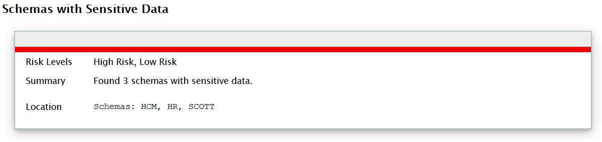
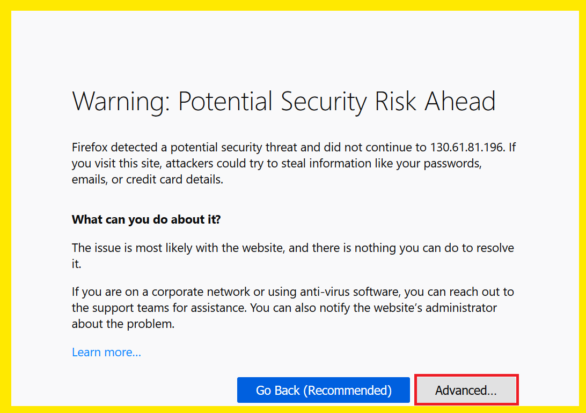
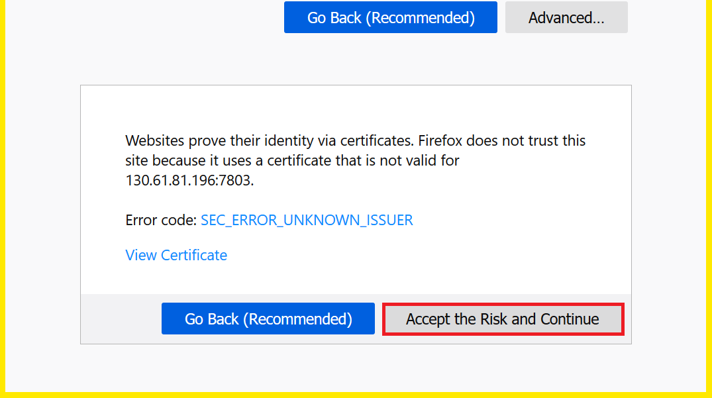
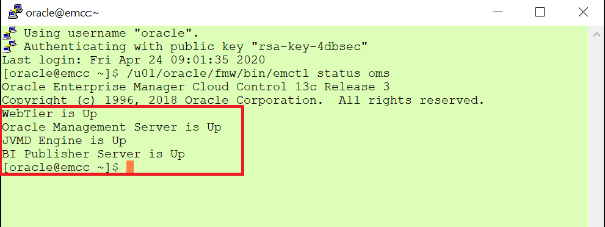

# Lab 9 - Masking Data with Enterprise Manager Cloud Control #

Initial description

## Disclaimer ##
The following is intended to outline our general product direction. It is intended for information purposes only, and may not be incorporated into any contract. It is not a commitment to deliver any material, code, or functionality, and should not be relied upon in making purchasing decisions. The development, release, and timing of any features or functionality described for Oracle’s products remains at the sole discretion of Oracle.

## Requirements ##

Instructions in this lab expect that you have completed all the previous labs in the workshop.

## Introduction  ##

We have already seen that our database contains sensitive data:



In this chapter, we will use EM13cR3 Data Masking & Subsetting Pack to anonymize sensitive data before sharing it with developers or third parties.

## Step 1 : Relax network settings for secdb ##

Remove or lower the following network settings on secdb, which Enterprise Manager Cloud Control 13cR3 still does not support with a default installation.

Modify sqlnet.ora on secdb as shown below:


## Step 2 : Connect to Enterprise Manager Cloud Control ##

You can then connect to EM13cR3 at the following URL:

**https://<EM CC PUBLIC IP>:7803/em**

Allow a security exception as we are just using a self-signed certificate and connect as **sysman**, password **MyDbPwd#1**.






TIP:  In case of difficulty, create a PuTTY connection to emcc with the same settings as for secdb and using emcc’s public IP and the same private key (and no SSH tunnel).

You can then connect to emcc as oracle and check whether the whole stack has been started by executing:

/u01/oracle/fmw/bin/emctl status oms

Wait until the whole stack is up



## Step 3 : Cloning PDB1 ##

We start this exercise by creating a new pluggable database named **MASKED** as a clone of the production pluggable database PDB1. We will later run an **in-database anonymization** of PDB MASKED.

Using a terminal window to secdb, execute mask20_clone.sh to clone PDB1

````
$ <copy>cd /home/oracle/HOL/lab09_masking</copy>
````

````
$ <copy>mask20_clone.sh</copy>

SQL*Plus: Release 19.0.0.0.0 - Production on Fri Apr 24 14:45:38 2020
Version 19.6.0.0.0
Connected.

SQL> -- clone PDB1 as MASKED
SQL> create pluggable database masked from pdb1 keystore identified by "MyWalletPwd#1";
Pluggable database created.

SQL> alter pluggable database masked open read write;
Pluggable database altered.
````

To mask data and also because we operate in a Database Vault environment, we need to grant additional privileges to SYSTEM on MASKED.

````
$ <copy>mask30_grant.sh</copy>

SQL*Plus: Release 19.0.0.0.0 - Production on Fri Apr 24 14:49:20 2020
Connected.

SQL> --
SQL> -- the following privileges are required by Data Modeling & Masking
SQL> -- in a Database Vault environment
SQL> --
SQL> alter session set container=masked;
Session altered.

SQL> grant execute on dbms_crypto to system;
Grant succeeded.

SQL> grant execute on dbms_aqadm to system;
Grant succeeded.

SQL> grant execute on utl_file to system;
Grant succeeded.

SQL>
SQL> connect c##dbvo/"_c2h5oh_"@localhost/masked
Connected.
SQL> exec dbms_macadm.authorize_ddl('SYSTEM','DBSNMP')
PL/SQL procedure successfully completed.
````

To enable advanced masking formats in our database, we also need to run a script, which adds the **DM_FMTLIB** package to the **DBSNMP** schema. The scripts (one for the package definition, the other for the package body) can be found on the EM13cR3 server in the following directory:

* $PLUGIN_HOME/sql/db/latest/masking/dm_fmtlib_pkgdef.sql
* $PLUGIN_HOME/sql/db/latest/masking/dm_fmtlib_pkgbody.sql

These scripts have already been copied to secdb. Please run them by executing the following command.

````
$ <copy>mask35_dm_fmtlib.sh</copy>

(...)
2957  function get_version return varchar2 is
2958  begin
2959     return DM_FORMAT_DRV_VERSION;
2960  end;
2961
2962  END DM_FMTLIB;
2963  /

Package body created.

SQL> SHOW ERRORS;
No errors.
SQL> exit
````

We should now be ready to create an Application Data Model.

## Acknowledgements ##

- **Authors** - Adrian Galindo & François Pons, PTS EMEA - April 2020.
- **Credits** - This lab is based on materials provided by Oracle Database Security Product Management.
