# Lab 9 - Masking Data with Enterprise Manager Cloud Control #

This lab will demonstrate how to use Oracle Enterprise Manager Cloud Control Data Masking and Subsetting Pack to discover  and anonymize sensitive data in an Oracle database. The Data Masking and Subsetting Pack is a pre-installed module of Enterprise Manager.

## Disclaimer ##
The following is intended to outline our general product direction. It is intended for information purposes only, and may not be incorporated into any contract. It is not a commitment to deliver any material, code, or functionality, and should not be relied upon in making purchasing decisions. The development, release, and timing of any features or functionality described for Oracle’s products remains at the sole discretion of Oracle.

## Requirements ##

Instructions in this lab expect that you have completed all the previous labs in the workshop.

## Introduction  ##

We have already seen that our database contains sensitive data:


In this chapter, we will use EM13cR3 Data Masking & Subsetting Pack to anonymize sensitive data before sharing it with developers or third parties.

## Step 1 : Relax network settings for secdb ##

Remove or lower the following network settings on secdb, which Enterprise Manager Cloud Control 13cR3 still does not support with a default installation.

Modify sqlnet.ora on secdb as shown below:


## Step 2 : Connect to Enterprise Manager Cloud Control ##

You can then connect to EM13cR3 at the following URL:

**https://&lt EM CC PUBLIC IP &gt:7803/em**

Allow a security exception as we are just using a self-signed certificate and connect as **sysman**, password **MyDbPwd#1**.


TIP:  In case of difficulty, create a PuTTY connection to emcc with the same settings as for secdb and using emcc’s public IP and the same private key (and no SSH tunnel).

You can then connect to emcc as oracle and check whether the whole stack has been started by executing:

/u01/oracle/fmw/bin/emctl status oms

Wait until the whole stack is up


## Step 3 : Cloning PDB1 ##

We start this exercise by creating a new pluggable database named **MASKED** as a clone of the production pluggable database PDB1. We will later run an **in-database anonymization** of PDB MASKED.

Using a terminal window to secdb, execute mask20_clone.sh to clone PDB1

````
$ <copy>cd /home/oracle/HOL/lab09_masking</copy>
````

````
$ <copy>mask20_clone.sh</copy>

SQL*Plus: Release 19.0.0.0.0 - Production on Fri Apr 24 14:45:38 2020
Version 19.6.0.0.0
Connected.

SQL> -- clone PDB1 as MASKED
SQL> create pluggable database masked from pdb1 keystore identified by "MyWalletPwd#1";
Pluggable database created.

SQL> alter pluggable database masked open read write;
Pluggable database altered.
````

To mask data and also because we operate in a Database Vault environment, we need to grant additional privileges to SYSTEM on MASKED.

````
$ <copy>mask30_grant.sh</copy>

SQL*Plus: Release 19.0.0.0.0 - Production on Fri Apr 24 14:49:20 2020
Connected.

SQL> --
SQL> -- the following privileges are required by Data Modeling & Masking
SQL> -- in a Database Vault environment
SQL> --
SQL> alter session set container=masked;
Session altered.

SQL> grant execute on dbms_crypto to system;
Grant succeeded.

SQL> grant execute on dbms_aqadm to system;
Grant succeeded.

SQL> grant execute on utl_file to system;
Grant succeeded.

SQL>
SQL> connect c##dbvo/"_c2h5oh_"@localhost/masked
Connected.
SQL> exec dbms_macadm.authorize_ddl('SYSTEM','DBSNMP')
PL/SQL procedure successfully completed.
````

To enable advanced masking formats in our database, we also need to run a script, which adds the **DM_FMTLIB** package to the **DBSNMP** schema. The scripts (one for the package definition, the other for the package body) can be found on the EM13cR3 server in the following directory:

* $PLUGIN\_HOME/sql/db/latest/masking/dm\_fmtlib\_pkgdef.sql
* $PLUGIN\_HOME/sql/db/latest/masking/dm\_fmtlib\_pkgbody.sql

These scripts have already been copied to secdb. Please run them by executing the following command.

````
$ <copy>mask35_dm_fmtlib.sh</copy>

(...)
2957  function get_version return varchar2 is
2958  begin
2959     return DM_FORMAT_DRV_VERSION;
2960  end;
2961
2962  END DM_FMTLIB;
2963  /

Package body created.

SQL> SHOW ERRORS;
No errors.
SQL> exit
````

We should now be ready to create an Application Data Model.

## Step 4 : Configure PDB MASKED in Enterprise Manager ##

* Connect to Enterprise Manager (**SYSMAN / MyDbPwd#1**)
* Got to **Setup** > **Add Target** > **Configure Auto Discovery**
* Select **secdb** and click on **Discover now**

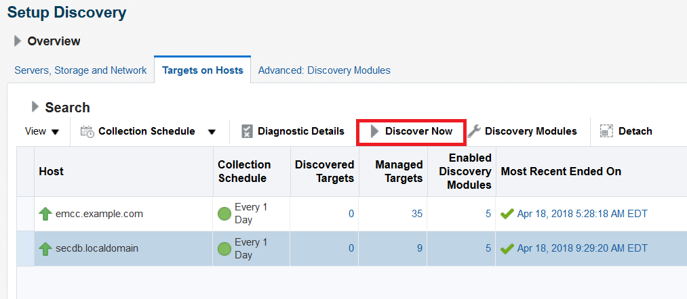

* Go to **Setup** > **Add Target** > **Auto Discovery Results**
* Select **CONT_MASKED** and **Promote** the PDB


*	Enter password for DBSNMP: **MyDbPwd#1**, then click **Next** and **Save**.

## Step 5 : Create the Application Data Model ##

* Go to **Targets** > **Databases** and click on **CONT_MASKED**
*	Go to **Security** > **Application Data Modeling** and click on **Create**.

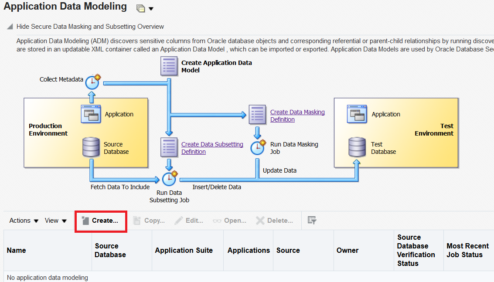

Enter **Name**, **Description** and select Source Database as follows, then click **Continue**.

Select the **HCM** schema and click **Continue** and **Submit** the job immediately.

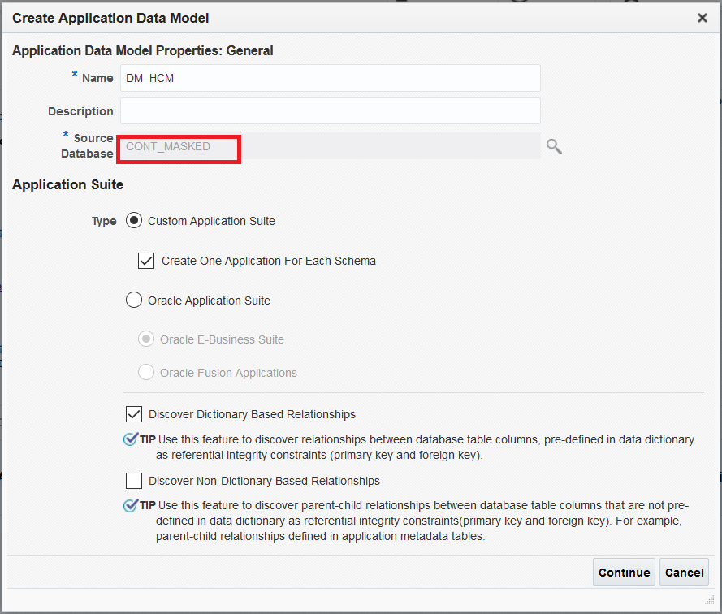

We can now review the Data Model.

* Go to **Targets** > **Databases**
*	Select **CONT_MASKED**
*	Go to **Security** > **Application Data Modeling**, Select **DM_HCM** and **Edit**.

Click on **Referential Relationships** and expand the tree of objects to show the Parent – Dependent relationship automatically detected between **DEPARTMENTS** and **EMPLOYEES** on column **DEPARTMENT_ID**.


## Step 6 : Configure sensitive columns ##

We are now going to discover the **sensitive columns** that are good candidates to be anonymized.

Click on the **sensitive columns** tab and in the **Actions** menu, select **Create Discovery Job** and run it immediately.

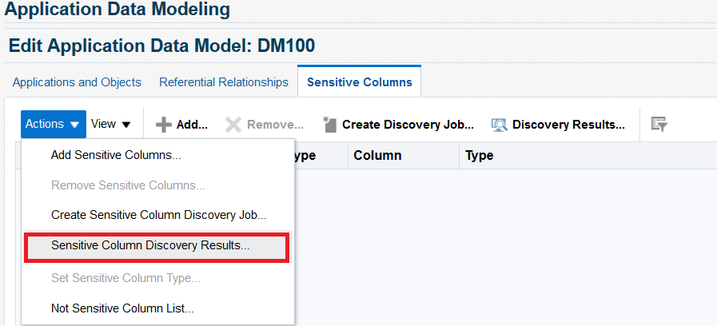

Select all applications and sensitive column types.

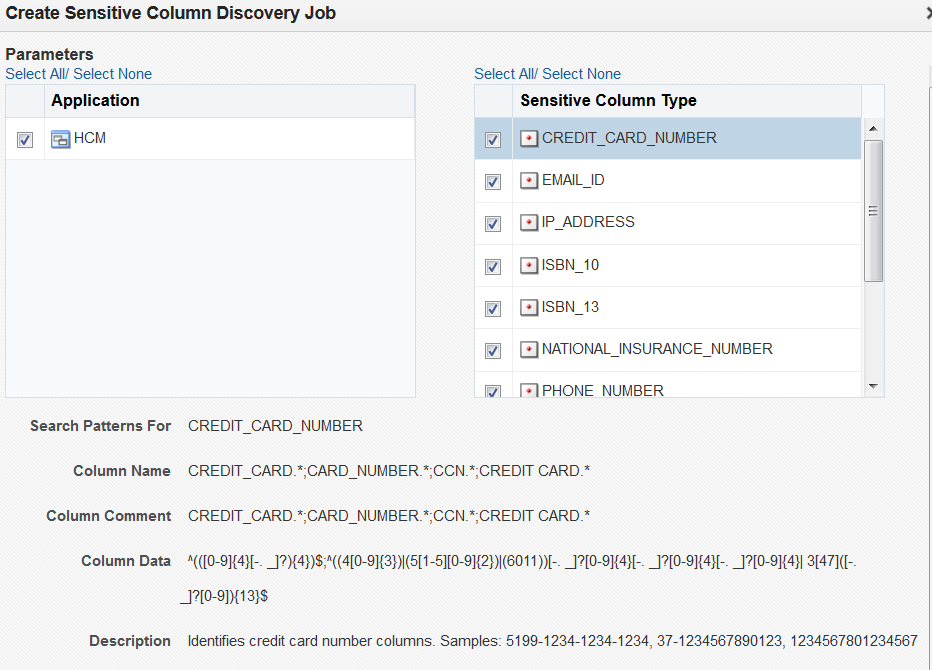

Click **Continue** and run the job immediately.

From the **Data Model** > **Sensitive columns**, click on **Actions** > **Sensitive Columns Discovery Results**.


Four columns are automatically discovered.

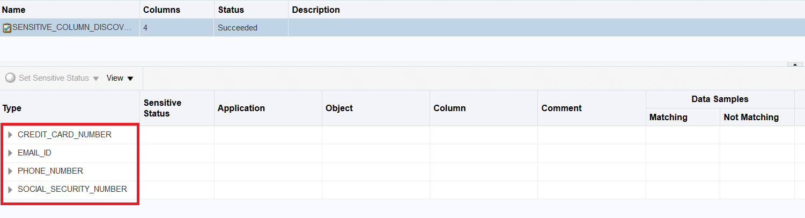

We now need to confirm the sensitive status of these columns and manually add columns we want to consider as sensitive even if they were not automatically discovered.

Let us start by confirming the status of the automatically discovered columns by selecting them individually and clicking on the **Set Sensitive Status** button to confirm the status as **sensitive**.


They should now all show as **sensitive columns**.

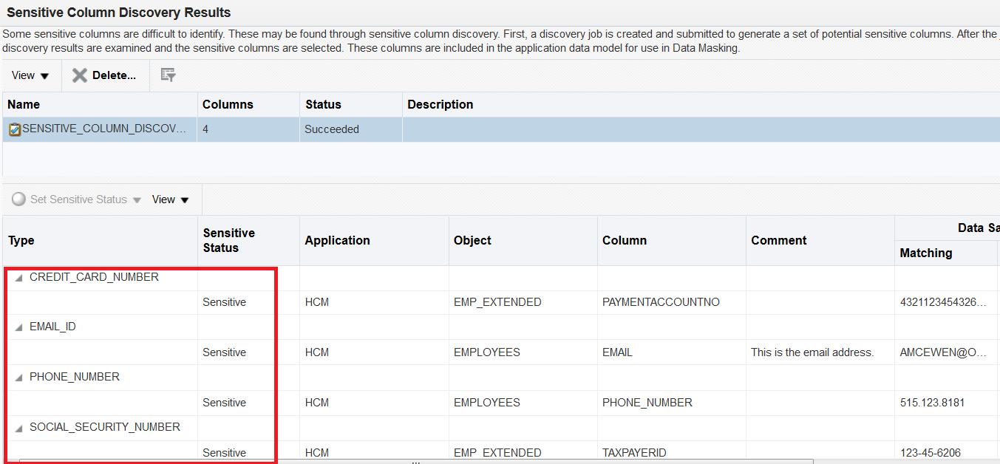

In many cases, we need to also manually add more sensitive columns.

Click on **Sensitive Columns** and **Add** and add three more columns from **HCM.EMPLOYEES**, then **Save** and Return.

*	EMPLOYEES.FIRST_NAME
*	EMPLOYEES.LAST_NAME
*	EMPLOYEES.SALARY


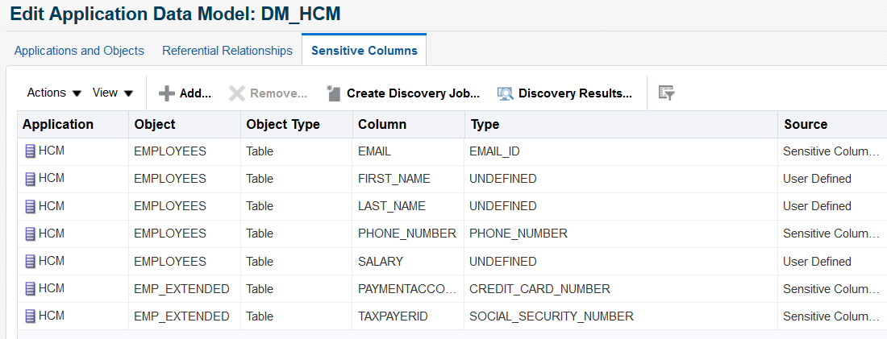

## Step 7 : Configure sensitive columns ##

We are now ready to create a Data Masking Definition applicable on our sensitive columns.

*	Go to **Targets** > **Databases**
*	Select **CONT_MASKED**
*	Go to **Security** > **Data Masking and Subsetting** > **Data Masking Definition**,
* Click **Create**

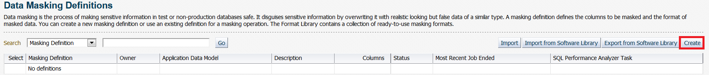

Select the Application Data Model, then click **Add** (columns)


Select the schema (**HCM**), click **Search** and **select all** sensitive columns, then click **Add**.

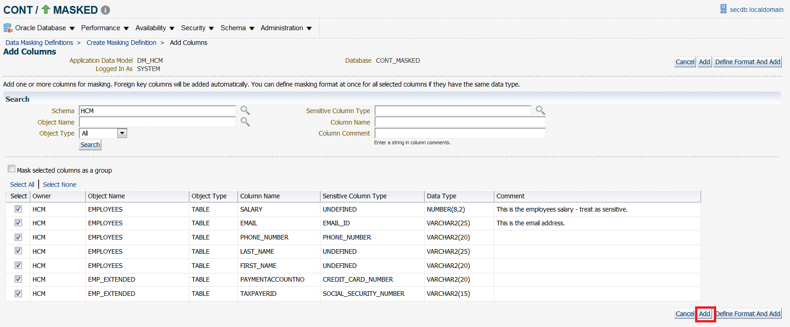

You should get the following table of columns to be masked. We can now click on the little wrench icon to define a masking transformation for each column.

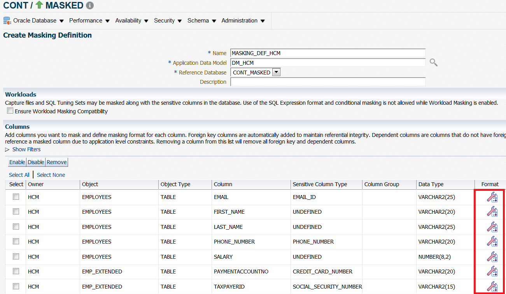

Let us generate random values for **FIRST\_NAME**, **LAST\_NAME** and **SALARY**. Click on the little wrench and program the following rules:

**FIRST_NAME:**
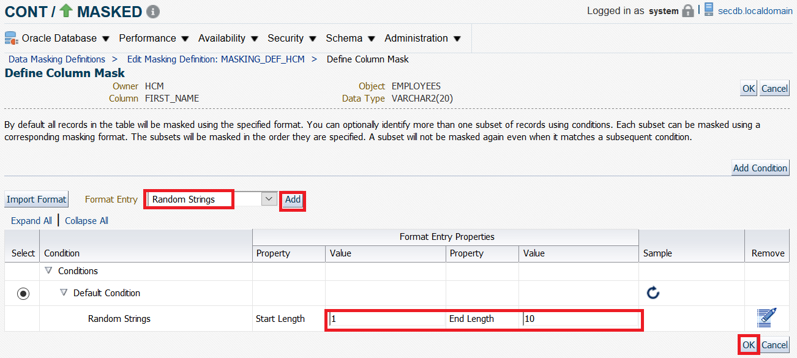

**LAST_NAME:**
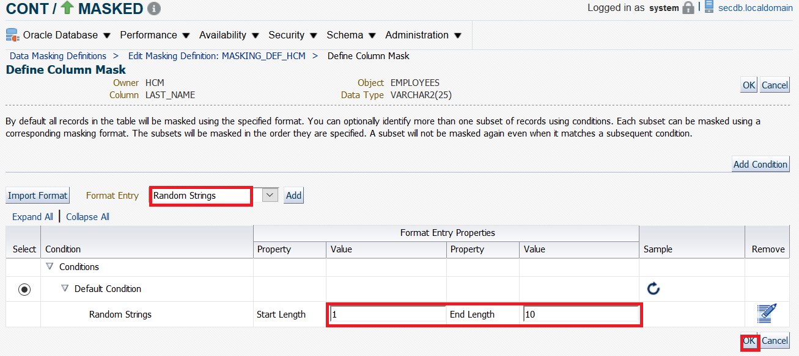

**SALARY:**


Let us use a SQL Expression for **EMAIL** to construct it from the anonymized value of **FIRST_NAME**.

Use the following expression:

<copy>%FIRST_NAME%||'@company.com'</copy>

**EMAIL:**
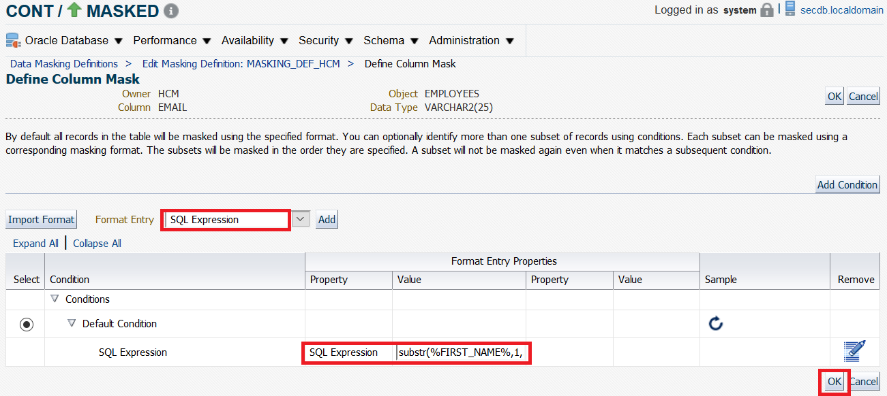

For **PAYMENTACCOUNTNO**, click on **Import Format**.

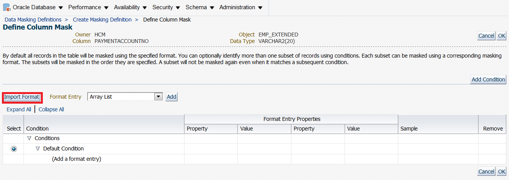

Select **Generic Credit Card Number Formatted**.


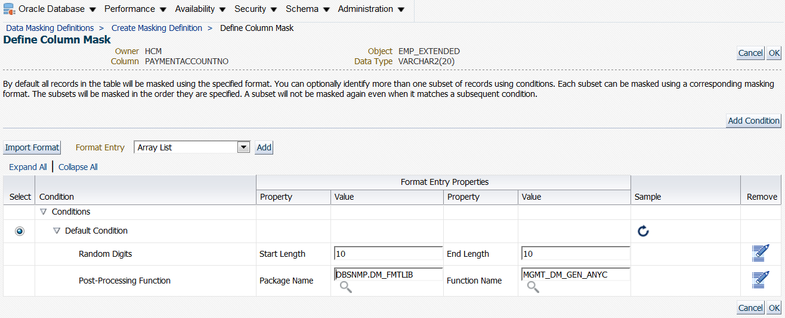

Similarly, set the following masking formats:

*	**PHONE_NUMBER**: import and use **(US) phone Number Formatted**.
*	**TAXPAYERID**: import **(US) Social Security Number Formatted**.

Then click on OK at the bottom of the screen to save the Data Masking Definition.


## Step 8 : Generate and run the masking script ##

Before generating the PL/SQL script, let us review some advanced options.

* Edit **Masking definition**
* Show **Advanced Options**
* Uncheck **Use parallel execution when possible**

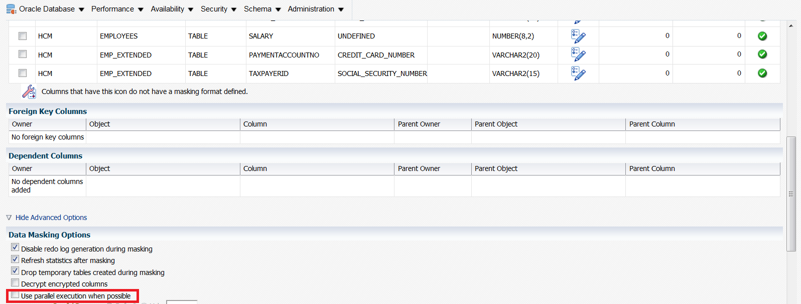

We can now generate the masking PL/SQL script:

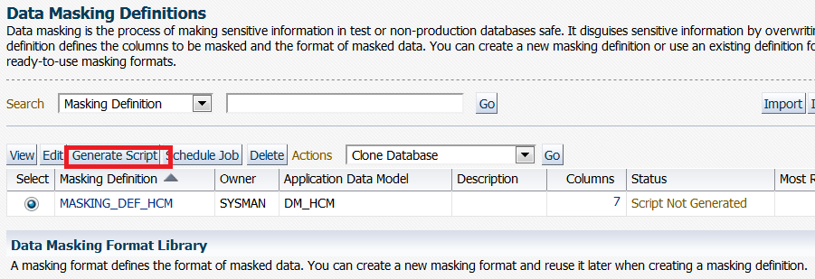

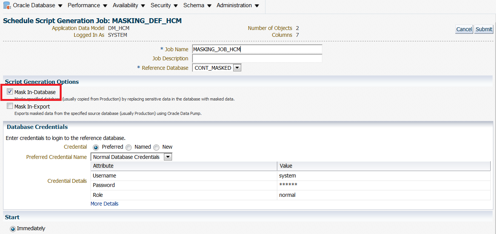

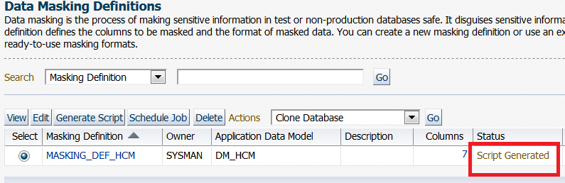

And we are finally ready to execute the masking job by scheduling an immediate execution…


In the **Schedule Data Masking Job** screen, be sure to select the following:

* Check **The selected target is not a production database.**

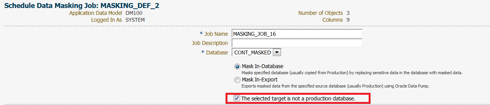

* Host & Database Credentials : select the default ones:


You can now compare the original and masked data in the database by running the following scripts on secdb:

````
$ <copy>cd /home/oracle/HOL/lab09_masking</copy>
````

````
$ <copy>mask40_view_original.sh</copy>

LAST_NAME                     SALARY EMAIL                     PAYMENTACCOUNTNO     TAXPAYERID
------------------------- ---------- ------------------------- -------------------- ---------------
OConnell                        2600 DOCONNEL@ORACLE.COM       4321123454326198     123-45-6198
Grant                           2600 DGRANT@ORACLE.COM         4321123454326199     123-45-6199
Whalen                          4400 JWHALEN@ORACLE.COM        4321123454326200     123-45-6200
Hartstein                      13000 MHARTSTE@ORACLE.COM       4321123454326201     123-45-6201
Fay                             6000 PFAY@ORACLE.COM           4321123454326202     123-45-6202
Mavris                          6500 SMAVRIS@ORACLE.COM        4321123454326203     123-45-6203
Baer                           10000 HBAER@ORACLE.COM          4321123454326204     123-45-6204
Higgins                        12008 SHIGGINS@ORACLE.COM       4321123454326205     123-45-6205
Gietz                           8300 WGIETZ@ORACLE.COM         4321123454326206     123-45-6206
````

Let us now view the anonymized data:

````
$ <copy>mask50_view_masked.sh</copy>

LAST_NAME                     SALARY EMAIL                     PAYMENTACCOUNTNO     TAXPAYERID
------------------------- ---------- ------------------------- -------------------- ---------------
aakjaaqave                     19849 aaaaajukam@company.com    2100-0476-5520-0000  244-51-7000
aaaaadlaqd                     10134 aaaaaagfwd@company.com    3682-4820-9001-4340  714-26-4001
asdnbmiazf                     10134 aaaaanrphd@company.com    3337-6315-3080-0275  079-16-9002
anzqwywavf                      9725 aaaaacrgaz@company.com    5157-3259-2003-6903  599-47-6003
aaaaamuauf                     19939 aaadukapai@company.com    3528-7708-1680-0416  701-27-4004
atmrastard                      4112 aamakursap@company.com    5406-0182-2005-5413  288-73-0005
ackvpwgaod                      4112 aaaaamzczd@company.com    4556-4800-8140-0693  477-71-4006
ajtztgeaar                     12824 awfrkcqdak@company.com    3717-3313-1007-4379  359-92-3007
````


**This completes the Data Masking lab.**

## Acknowledgements

- **Authors** - Adrian Galindo, PTS LAD & François Pons, PTS EMEA - Database Product Management - May 2020.
- **Credits** - This lab is based on materials provided by Oracle Database Security Product Management.