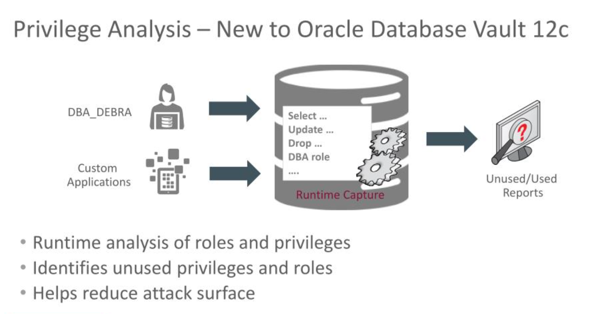

# Bonus Lab 2: Privilege Analysis

**Privilege Analysis** determines the minimum set of privileges required by a user or role, thus enforcing a least privilege approach.



## Disclaimer ##

<em>The following is intended to outline our general product direction. It is intended for information purposes only, and may not be incorporated into any contract. It is not a commitment to deliver any material, code, or functionality, and should not be relied upon in making purchasing decisions. The development, release, and timing of any features or functionality described for Oracle’s products remains at the sole discretion of Oracle.</em>

## Requirements ##

* SSH Session connected to **secdb** as user **oracle**

## Introduction  ##

The Privilege Analysis feature may be helpful to determine the minimum set of privileges required by a user or role. In some cases, it may be possible to substitute a more limited object privilege grant in place of a system privilege grant that applies to all objects.

In our example, we will reduce the privileges granted to **DBA\_NICOLE** to the minimum she really needs.

### Additional Resources ###
* [Oracle Database Security Privilege Analysis](https://www.oracle.com/database/technologies/security/priv-analysis.html)
* [Performing Privilege Analysis to Find Privilege Use](https://docs.oracle.com/en/database/oracle/oracle-database/19/dbseg/performing-privilege-analysis-find-privilege-use.html)

## Step 1 : _NICOLE's current role ##

**DBA\_NICOLE** is a junior DBA who was initially granted the full **DBA** role. Run the following script from a terminal window to the **secdb** server.

````
[oracle@secdb ~]$ <copy>cd /home/oracle/HOL/lab05_pa</copy>
````

````
[oracle@secdb lab05_pa]$ <copy>pa10_show_nicole_privs.sh</copy>

(...)
SQL> --
SQL> -- Show Nicole's privileges
SQL> --
SQL> select grantee, granted_role from dba_role_privs where grantee = 'DBA_NICOLE';

GRANTEE              GRANTED_ROLE
-------------------- --------------------
DBA_NICOLE           DBA
(...)
````

## Step 2 : Check DBA\_DEBRA can run Privilege Analysis ##

**DBA\_DEBRA** is the main **DBA**. Before beginning, let us make sure she has the **CAPTURE\_ADMIN** role required to execute a privilege analysis.

````
[oracle@secdb lab05_pa]$ <copy>pa11_show_debra_privs.sh</copy>

(...)
SQL> --
SQL> -- Does DBA_DEBRA have the CAPTURE_ADMIN role?
SQL> --
SQL> select sys_context('SYS_SESSION_ROLES','CAPTURE_ADMIN') has_capture_role from dual;

HAS_CAPTURE_ROLE
--------------------
TRUE
(...)
````


## Step 3 : Create a Privilege Analysis job ##

We can now create a privilege analysis job to capture the privileges used by **DBA\_NICOLE**.

````
[oracle@secdb lab05_pa]$ <copy>pa20_create_capture.sh</copy>

(...)
SQL> --
SQL> -- Create a database privilege analysis policy
SQL> --
SQL> begin
  2   dbms_privilege_capture.create_capture(
  3   name  => 'NICOLE_PRIVS_ANALYSIS',
  4   type  => dbms_privilege_capture.g_context,
  5 condition =>  'sys_context(''USERENV'',''SESSION_USER'')=''DBA_NICOLE''');
  6  end;
  7  /
PL/SQL procedure successfully completed.
SQL> --
SQL> -- Look to see if our capture exists
SQL> --
SQL> select NAME, TYPE, ENABLED from DBA_PRIV_CAPTURES where NAME = 'NICOLE_PRIVS_ANALYSIS';

NAME                      TYPE            ENABLED
------------------------- --------------- ----------
NICOLE_PRIVS_ANALYSIS     CONTEXT         N
(...)
````

## Step 4 : Start the capture process ##

**DBA\_DEBRA** can now start the capture process.

````
[oracle@secdb lab05_pa]$ <copy>pa21_start_capture.sh</copy>

(...)
SQL> --
SQL> -- Start privs analysis capture process
SQL> --
SQL> begin
  2   dbms_privilege_capture.enable_capture(
  3     name => 'NICOLE_PRIVS_ANALYSIS'
  4     );
  5  end;
  6  /
PL/SQL procedure successfully completed.
(...)
````

## Step 5 : Nicole does her work ##

Now that the capture process is running, **Nicole** can connect and do her task. For instance, she may work as some SQL tuning tasks.

````
[oracle@secdb lab05_pa]$ <copy>pa30_work_nicole.sh</copy>

(...)
SQL> --
SQL> -- Do Nicole's work
SQL> --
SQL> explain plan for
  2  SELECT
  3          departments.department_name, COUNT(*) AS staff
  4  FROM
  5          hcm.employees
  6  INNER JOIN
  7          hcm.departments ON departments.department_id = employees.department_id
  8  GROUP BY
  9          departments.department_name;
Explained.
(...)
````

## Step 6 : Stop the capture process ##

When **Debra** is sure **Nicole** has executed a representative subset of her tasks, she can stop the capture process.

````
[oracle@secdb lab05_pa]$ <copy>pa40_stop_capture.sh</copy>

(...)
SQL> --
SQL> -- Status of our capture
SQL> --
SQL> select NAME, TYPE, ENABLED from DBA_PRIV_CAPTURES where NAME = 'NICOLE_PRIVS_ANALYSIS';

NAME                      TYPE            ENABLED
------------------------- --------------- ----------
NICOLE_PRIVS_ANALYSIS     CONTEXT         Y

SQL> --
SQL> -- Disable the capture process
SQL> --
SQL> begin
  2    dbms_privilege_capture.disable_capture(
  3    name    => 'NICOLE_PRIVS_ANALYSIS');
  4  end;
  5  /
PL/SQL procedure successfully completed.

SQL> --
SQL> -- Status of our capture
SQL> --
SQL> select NAME, TYPE, ENABLED from DBA_PRIV_CAPTURES where NAME = 'NICOLE_PRIVS_ANALYSIS';

NAME                      TYPE            ENABLED
------------------------- --------------- ----------
NICOLE_PRIVS_ANALYSIS     CONTEXT         N
(...)
````

## Step 7 : Generate results ##

**Debra** can now make the following call to generate results.


````
[oracle@secdb lab05_pa]$ <copy>pa50_generate_result.sh</copy>

(...)
SQL>
SQL> --
SQL> -- Generate reports
SQL> --
SQL> begin
  2    dbms_privilege_capture.generate_result(
  3    name    => 'NICOLE_PRIVS_ANALYSIS');
  4  end;
  5  /

PL/SQL procedure successfully completed.
(...)
````

## Step 8 : View results ##

The result of the privilege analysis is accessible by querying a series of specific data dictionary views reporting the system and object privileges and roles actually used.

In the next script, we will select from two of these views (**DBA\_USED\_SYSPRIVS** and **DBA\_USED\_OBJPRIVS**) the **actual privileges** required by **NICOLE** and put them into a new **DBA\_TUNING\_ROLE** role.

We can then revoke **DBA** from **NICOLE** and replace it by this **DBA\_TUNING\_ROLE** granting a more limited set of privileges than those offered by a full **DBA** role.


````
[oracle@secdb lab05_pa]$ <copy>pa60_show_used_privs.sh</copy>

(...)
SQL> -- Show privileges required by Nicole
SQL> select 'GRANT '||SYS_PRIV||' to dba_tuning_role; ' from dba_used_sysprivs
  2  where username = 'DBA_NICOLE';

'GRANT'||SYS_PRIV||'TODBA_TUNING_ROLE;'
-------------------------------------------------------------------
GRANT EXEMPT REDACTION POLICY to dba_tuning_role;
GRANT CREATE SESSION to dba_tuning_role;
GRANT SELECT ANY TABLE to dba_tuning_role;

SQL> select 'GRANT '||OBJ_PRIV||' ON '||OBJECT_OWNER||'.'||OBJECT_NAME||' to dba_tuning_role;' from  dba_used_objprivs where
  2  username = 'DBA_NICOLE'
  3  order by OBJECT_OWNER, OBJECT_NAME;

'GRANT'||OBJ_PRIV||'ON'||OBJECT_OWNER||'.'||OBJECT_NAME||'TODBA_TUNING_ROLE;'
-------------------------------------------------------------------
GRANT EXECUTE ON SYS.DBMS_APPLICATION_INFO to dba_tuning_role;
GRANT EXECUTE ON SYS.DBMS_OUTPUT to dba_tuning_role;
GRANT EXECUTE ON SYS.DBMS_XPLAN to dba_tuning_role;
GRANT EXECUTE ON SYS.DBMS_XPLAN_TYPE_TABLE to dba_tuning_role;
GRANT SELECT ON SYS.DUAL to dba_tuning_role;
GRANT SELECT ON SYS.DUAL to dba_tuning_role;
GRANT SELECT ON SYS.PLAN_TABLE$ to dba_tuning_role;
GRANT INSERT ON SYS.PLAN_TABLE$ to dba_tuning_role;
GRANT EXECUTE ON SYS.XMLSEQUENCE to dba_tuning_role;
GRANT EXECUTE ON SYS.XMLTYPE to dba_tuning_role;
GRANT READ ON SYSTEM.PRODUCT_PRIVS to dba_tuning_role;

SQL> -- generate a script to create the ad hoc role
GRANT EXEMPT REDACTION POLICY to dba_tuning_role;
GRANT CREATE SESSION to dba_tuning_role;
GRANT SELECT ANY TABLE to dba_tuning_role;
GRANT EXECUTE ON SYS.DBMS_APPLICATION_INFO to dba_tuning_role;
GRANT EXECUTE ON SYS.DBMS_OUTPUT to dba_tuning_role;
GRANT EXECUTE ON SYS.DBMS_XPLAN to dba_tuning_role;
GRANT EXECUTE ON SYS.DBMS_XPLAN_TYPE_TABLE to dba_tuning_role;
GRANT SELECT ON SYS.DUAL to dba_tuning_role;
GRANT SELECT ON SYS.DUAL to dba_tuning_role;
GRANT SELECT ON SYS.PLAN_TABLE$ to dba_tuning_role;
GRANT INSERT ON SYS.PLAN_TABLE$ to dba_tuning_role;
GRANT EXECUTE ON SYS.XMLSEQUENCE to dba_tuning_role;
GRANT EXECUTE ON SYS.XMLTYPE to dba_tuning_role;
GRANT READ ON SYSTEM.PRODUCT_PRIVS to dba_tuning_role;
(...)
````

## Step 9 : Create and grant an ad hoc role to NICOLE ##

Rn the following script to create and grant an ad hoc role to NICOLE

````
[oracle@secdb lab05_pa]$ <copy>pa70_set_new_role.sh</copy>

(...)
SQL> -- Create and grant an ad hoc role to NICOLE
SQL> create role dba_tuning_role;
Role created.

SQL> @/tmp/create_tuning_role
SQL> GRANT EXEMPT REDACTION POLICY to dba_tuning_role;
Grant succeeded.
SQL> GRANT CREATE SESSION to dba_tuning_role;
Grant succeeded.
SQL> GRANT SELECT ANY TABLE to dba_tuning_role;
Grant succeeded.
SQL> GRANT EXECUTE ON SYS.DBMS_APPLICATION_INFO to dba_tuning_role;
Grant succeeded.
SQL> GRANT EXECUTE ON SYS.DBMS_OUTPUT to dba_tuning_role;
Grant succeeded.
SQL> GRANT EXECUTE ON SYS.DBMS_XPLAN to dba_tuning_role;
Grant succeeded.
SQL> GRANT EXECUTE ON SYS.DBMS_XPLAN_TYPE_TABLE to dba_tuning_role;
Grant succeeded.
SQL> GRANT SELECT ON SYS.DUAL to dba_tuning_role;
Grant succeeded.
SQL> GRANT SELECT ON SYS.DUAL to dba_tuning_role;
Grant succeeded.
SQL> GRANT SELECT ON SYS.PLAN_TABLE$ to dba_tuning_role;
Grant succeeded.
SQL> GRANT INSERT ON SYS.PLAN_TABLE$ to dba_tuning_role;
Grant succeeded.
SQL> GRANT EXECUTE ON SYS.XMLSEQUENCE to dba_tuning_role;
Grant succeeded.
SQL> GRANT EXECUTE ON SYS.XMLTYPE to dba_tuning_role;
Grant succeeded.
SQL> GRANT READ ON SYSTEM.PRODUCT_PRIVS to dba_tuning_role;
Grant succeeded.

SQL> revoke dba from DBA_Nicole;
Revoke succeeded.

SQL> grant dba_tuning_role to DBA_Nicole;
Grant succeeded.
(...)
````

## Step 10 : Verify NICOLE can still do her work ##

Finally, we can run verify that Nicole is still able to complete her tasks

````
[oracle@secdb lab05_pa]$ <copy>pa30_work_nicole.sh</copy>

(...)
SQL> --
SQL> -- Do Nicole's work
SQL> --
SQL> explain plan for
  2  SELECT
  3          departments.department_name, COUNT(*) AS staff
  4  FROM
  5          hcm.employees
  6  INNER JOIN
  7          hcm.departments ON departments.department_id = employees.department_id
  8  GROUP BY
  9          departments.department_name;
Explained.

SQL>
SQL> select * from table(dbms_xplan.display);

PLAN_TABLE_OUTPUT
--------------------------------------------------------------------
Plan hash value: 2505473347
(...)
````

This completes the **Privilege Analysis** lab. You can continue with the next lab.

## Acknowledgements

- **Authors** - Adrian Galindo, PTS LAD & François Pons, PTS EMEA - Database Product Management - May 2020.
- **Credits** - This lab is based on materials provided by Oracle Database Security Product Management.
